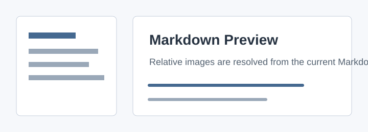

# Markdown Viewer Sample

This sample verifies the Avalonia MVP.

## Features

- Folder selection
- Markdown rendering
- Tables and code blocks
- Relative images
- Relative Markdown links
- Mermaid diagrams

| Item | Status |
|---|---|
| Markdig rendering | Ready |
| Mermaid rendering | Ready |
| Theme switching | Ready |

```csharp
Console.WriteLine("Markdown Viewer");
```



Open the [design note](./design.md) or the [Mermaid sample](./diagram.md).

External links open in the default browser: [Avalonia Docs](https://docs.avaloniaui.net/).
