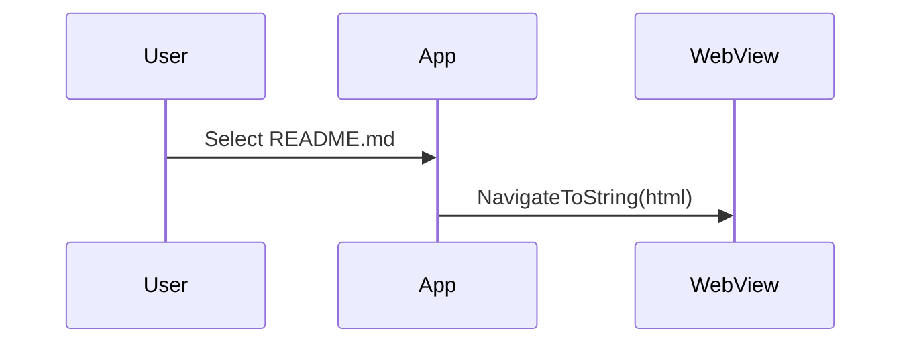

# Mermaid Sample

```mermaid
flowchart LR
    Folder[Open Folder] --> Tree[Explorer Tree]
    Tree --> Markdown[Read Markdown]
    Markdown --> Html[Render HTML]
    Html --> WebView[NativeWebView]
```

```mermaid
sequenceDiagram
    participant User
    participant App
    participant WebView
    User->>App: Select README.md
    App->>WebView: NavigateToString(html)
```

Back to [README](./README.md).
