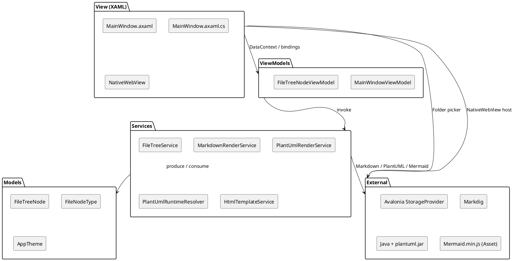
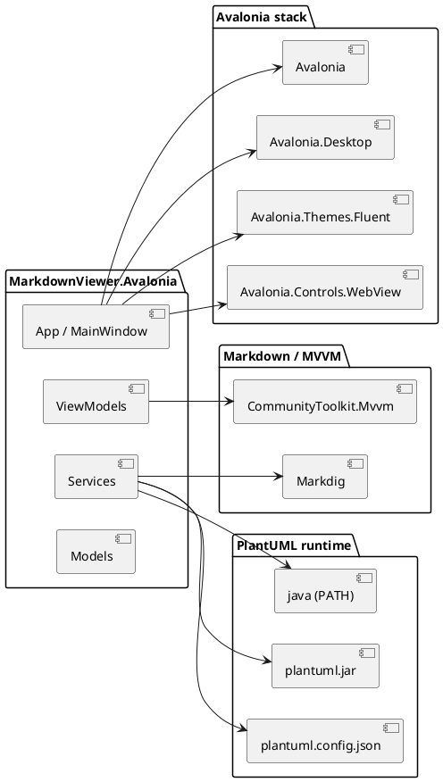
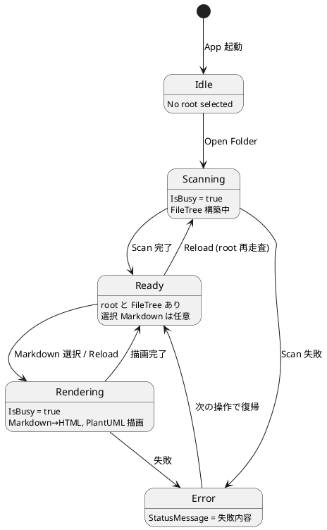

# Avalonia Viewer 基本設計

## 基本方針

MVVM 構成で UI 状態と処理を分離する。Markdown 変換やファイル走査は Service へ寄せ、ViewModel は操作の調停と表示状態の管理に集中する。Markdown プレビューは `NativeWebView` 上で HTML を表示し、Mermaid と PlantUML はそれぞれクライアント JS と外部 Java プロセスへ委譲する。

## Planned UX rollout

Tauri先行評価を受けたMenu / Status、Explorer、typed settings、trusted HTML、Multi-tab、左右2pane Split Viewは段階導入する。共通UX outcome、Avaloniaの責務境界、導入順序は[tauri_ux_rollout_spec.md](tauri_ux_rollout_spec.md)を正とする。現在の単一Markdown実装を説明する以下の設計と、未実装のtarget contractを混在させない。

## 責務

- View: レイアウト、バインディング、WebView ホスト、StorageProvider 経由のフォルダ選択。
- ViewModel: 選択中 root、ファイルツリー、選択 Markdown、テーマ、エラー / busy 状態、WebView へ渡す HTML の生成依頼。
- Service: ファイル走査、Markdown 変換、PlantUML レンダリング、PlantUML runtime 解決、HTML 文書テンプレート組み立て。
- Models: Explorer 用ノードと型、テーマ enum。

## 主要クラス

- `MainWindowViewModel`: Open Folder、Reload、Markdown 選択、テーマ切替、WebMessage ハンドリング。`IsBusy` / `StatusMessage` を保持。
- `FileTreeNodeViewModel`: Explorer ノード表示と選択状態。子ノードは `ObservableCollection`。
- `FileTreeService`: 除外ディレクトリ (`.git` / `node_modules` / `bin` / `obj` / `target` / `.venv` / `__pycache__`) を考慮した再帰走査。Directory→Markdown→Image の順で整列。
- `MarkdownRenderService`: Markdig (Advanced extensions) による Markdown HTML 化。`mermaid` / `plantuml` / `puml` の fence はプレースホルダで抽出し、Mermaid は DOM、PlantUML は SVG / エラー HTML に差し替える。
- `PlantUmlRenderService`: `IPlantUmlRuntimeResolver` から得た jar path を使い、Java を `ArgumentList` で起動して `-tsvg -pipe` で SVG を得る。10 秒タイムアウト。`<script>` 要素と `on*` 属性を除去してサニタイズ。
- `PlantUmlRuntimeResolver`: working directory と `AppContext.BaseDirectory` を探索し、`plantuml.config.json` の `plantUmlJarPath` を解決、もしくは同階層の `plantuml.jar` を採用する。
- `HtmlTemplateService`: `<base>` + CSS + Mermaid script + リンクハンドラ JS を含む HTML 文書を組み立てる。テーマに合わせて `html.dark` クラスと Mermaid テーマを切り替える。

## レイヤー構成（コンポーネント図）



## 依存方向

```text
View -> ViewModel -> Services -> Models
                              -> External (Markdig / Java / Mermaid asset)
```

ViewModel は View へ依存しない。Service は UI 状態へ依存しない。Service 間の依存は `MarkdownRenderService → PlantUmlRenderService → PlantUmlRuntimeResolver` の一方向。

## 依存パッケージ図



## 状態モデル

`MainWindowViewModel` のメイン状態は次の遷移をとる。


