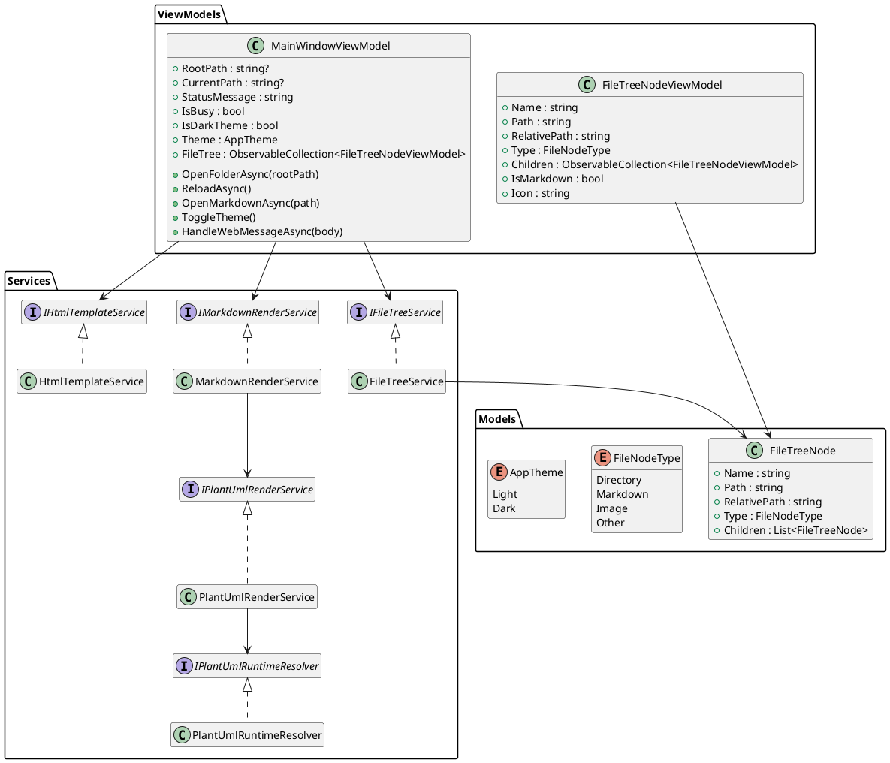
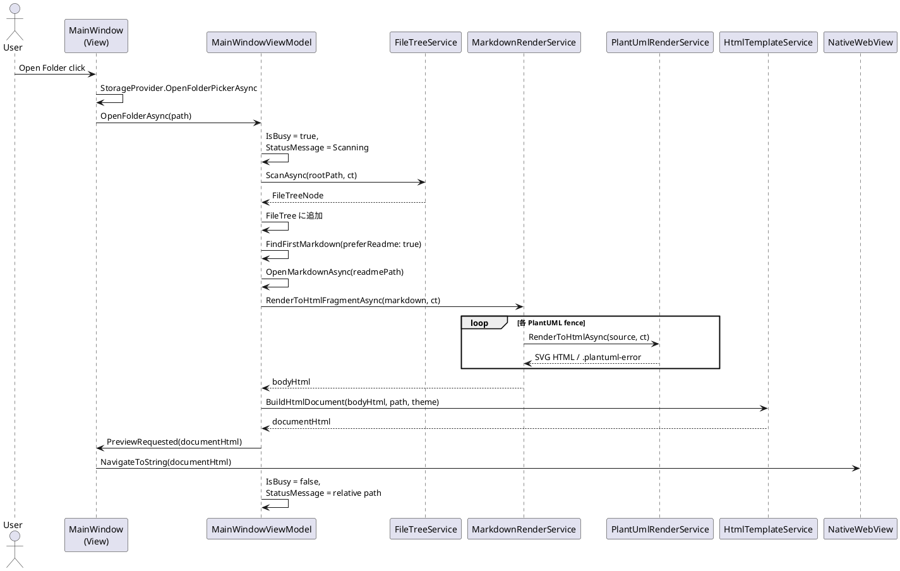
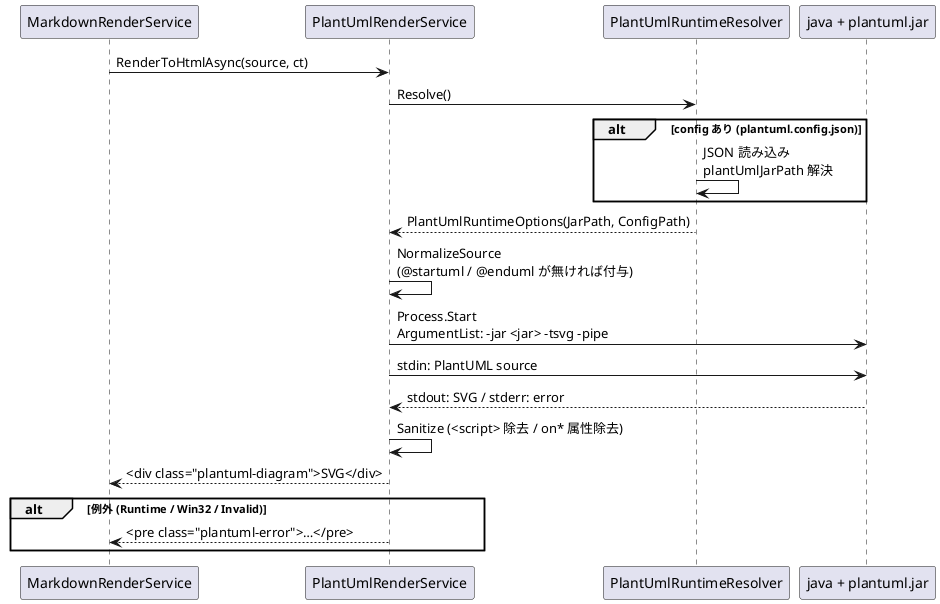
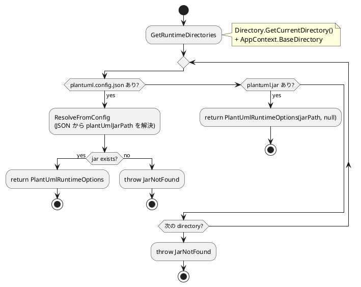

# Avalonia Viewer 詳細設計

## 状態管理

`MainWindowViewModel` が以下を保持する。

| プロパティ | 役割 | 補足 |
|---|---|---|
| `RootPath` | 選択中フォルダの絶対パス | `Path.GetFullPath` で正規化 |
| `FileTree` | Explorer に表示する `FileTreeNodeViewModel` のコレクション | `ObservableCollection` |
| `CurrentPath` | 表示中 Markdown の絶対パス | root 配下のみ受け付け |
| `IsBusy` | スキャン / レンダリング中フラグ | UI の `ProgressBar` / オーバーレイに連動 |
| `StatusMessage` | 上部バーに表示する状態メッセージ | エラーもここへ反映 |
| `IsDarkTheme` | テーマ状態 | `Theme` プロパティ経由で参照 |
| `_currentBodyHtml` | 直近の本体 HTML fragment | テーマ切替時の再構築用 |
| `_scanCancellation` | スキャン用 `CancellationTokenSource` | 連続 Open Folder のキャンセル |

## クラス図

## 処理フロー（Open Folder → Preview）

1. ユーザーが Open Folder を実行する。
2. `MainWindow.OpenFolderButton_OnClick` が `StorageProvider.OpenFolderPickerAsync` でフォルダを取得する。
3. `MainWindowViewModel.OpenFolderAsync` が `FileTreeService.ScanAsync` を呼ぶ。
4. Explorer に root ノードが追加され、README または最初の Markdown を自動選択する。
5. `OpenMarkdownAsync` が Markdown を `File.ReadAllTextAsync` で読み込み、`MarkdownRenderService.RenderToHtmlFragmentAsync` へ渡す。
6. `MarkdownRenderService` は `mermaid` / `plantuml` / `puml` fence をプレースホルダで抽出し、Markdig でテキスト本体を HTML へ変換した後、Mermaid は `
`、PlantUML は `PlantUmlRenderService.RenderToHtmlAsync` の結果（SVG または `.plantuml-error`）に差し替える。
7. `HtmlTemplateService.BuildHtmlDocument` が `<base href>`、CSS、Mermaid script、リンクハンドラ JS を含む完全な HTML 文書を組み立てる。
8. `MainWindowViewModel.PreviewRequested` イベントを通じて `MainWindow` 側で `PreviewWebView.NavigateToString` を呼び、WebView に反映する。
9. `IsBusy` 解除と `StatusMessage` 更新で UI を確定状態に戻す。

## Markdown 変換 (`MarkdownRenderService`)

- 正規表現 `DiagramFenceRegex` (multiline `mermaid` / `plantuml` / `puml` fence) で fence をマッチさせ、`DIAGRAM_BLOCK_<index:D4>` プレースホルダへ置換しつつ `DiagramBlock` のリストを構築する。
- Markdig (`UseAdvancedExtensions`) でテキスト本体を HTML 化する。プレースホルダが段落として包まれている場合 (`
DIAGRAM_BLOCK_0000
`) と裸の場合の両方を `Replace` で差し替える。
- Mermaid は HTML エンコード済みの内容を `
` で包み、PlantUML は `PlantUmlRenderService` の結果文字列をそのまま差し込む。

## Mermaid

Mermaid script (`Assets/mermaid.min.js`) は `HtmlTemplateService` でテンプレートに埋め込まれ、`mermaid.initialize({ startOnLoad: false, theme: ..., securityLevel: 'strict' })` の後に `mermaid.run({ querySelector: '.mermaid' })` を呼ぶ。`</script>` シーケンスは `<\\/script` へエスケープする。

## PlantUML

- 1 図あたり 10 秒タイムアウト。`CancellationTokenSource.CreateLinkedTokenSource` で外部 CT とリンクし、超過時は `Process.Kill(entireProcessTree: true)` で停止する。
- Java の起動失敗は `Win32Exception`、jar 未設定は `PlantUmlRuntimeException`、PlantUML 構文エラーや exit code≠0 は `InvalidOperationException` として捕捉し、HTML エスケープしたメッセージを `.plantuml-error` で表示する。
- テーマ切替時は PlantUML CLI を再実行せず、`_currentBodyHtml` を保持したまま `HtmlTemplateService.BuildHtmlDocument` を再構築して WebView に反映する。

### runtime 解決順

## エラーハンドリング

- ファイル読み込み / Markdown 変換 / WebView 表示の失敗は `StatusMessage` に反映する。
- スキャン中の `OperationCanceledException` は無視（次の Open Folder で上書き）する。
- PlantUML の図単位失敗はその位置のみ `.plantuml-error` で表示し、本文 HTML 全体は壊さない。

## WebView ↔ ホスト通信

`HtmlTemplateService` の JS は `invokeCSharpAction(JSON.stringify({ type, href }))` を介してメッセージを送る。`MainWindowViewModel.HandleWebMessageAsync` が次を処理する。

- `openExternal`: 絶対 URL を `Process.Start` の `UseShellExecute = true` で OS 既定ハンドラへ。
- `openMarkdown`: `file://` の `.md` / `.markdown` を `OpenMarkdownAsync` で開く。

## UI レイアウト

`MainWindow.axaml` の 2 行 × 2 列 Grid:

- 上段 (Row 0, ColumnSpan 2): Toolbar (`Open Folder` / `Theme` / `Reload` ボタン、StatusMessage、`IsBusy` 連動の indeterminate ProgressBar)。
- 左下 (Row 1, Col 0): `TreeView` (Explorer)。`FileTreeNodeViewModel.Icon` でディレクトリ / Markdown / Image を区別表示。
- 右下 (Row 1, Col 1): `NativeWebView` (`PreviewWebView`) と、`IsBusy` 時に重なる Loading オーバーレイ。
