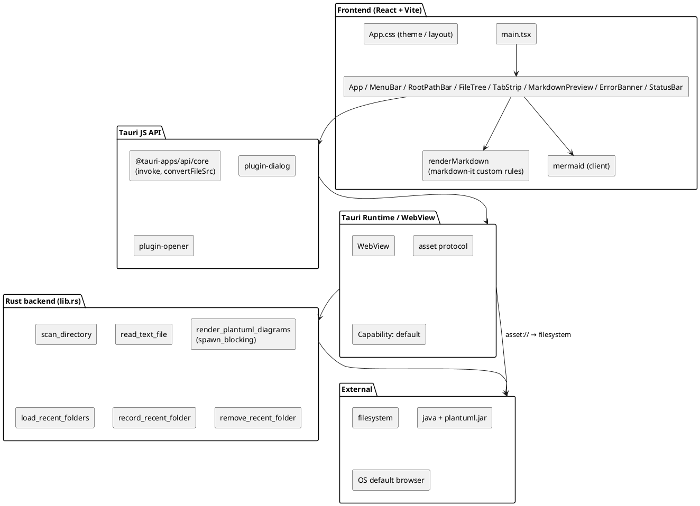
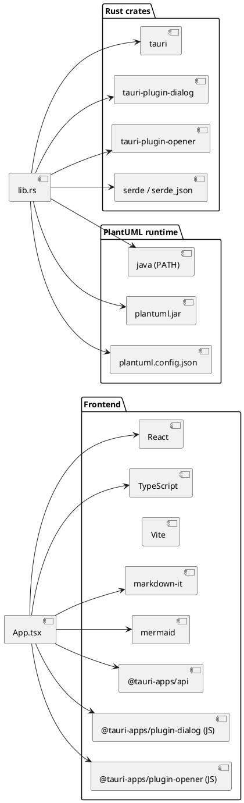
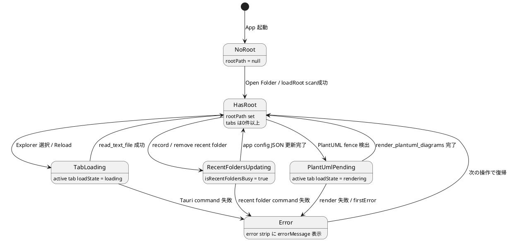

# Tauri Viewer 基本設計

## 基本方針

OS 連携とファイルシステム境界は Rust command へ寄せ、画面状態と Markdown 表示は React 側で扱う。Tauri が WebView を提供し、フロントは Vite で組み立てた React アプリ。PlantUML だけは Java プロセスを使うため Rust に集約する。

## 責務

- React: MenuBar dropdown、Recent Folders、root path strip、Explorer、TabStrip、Preview、error strip、StatusBar、テーマ、tab単位のエラー / loading、Markdown → HTML 変換、リンク処理。
- TypeScript renderer (`renderMarkdown`): `markdown-it` のカスタム fence / image / heading ルール。相対画像を `convertFileSrc` 経由で asset URL へ。相対 `.md` リンクをアプリ内遷移へ。
- Rust: root 配下の安全なファイル走査、Markdown 本文の UTF-8 読み込み、PlantUML レンダリング (Java プロセス起動)、Recent Folders の app config JSON 永続化。
- Tauri config: dialog / opener / asset protocol の権限管理。capability で plugin 利用を許可する。

## データモデル

`FileTreeNode` は Rust とフロントエンドで camelCase で対応する。

| field | 型 | 補足 |
|---|---|---|
| `name` | string | ファイル / ディレクトリ名 |
| `path` | string | OS 絶対パス |
| `relativePath` | string | root からの相対パス |
| `nodeType` | `"directory" \| "markdown" \| "image"` | enum |
| `children` | `FileTreeNode[]` | directory のみ非空、Directory→Markdown→Image の順で整列 |

PlantUML 結果も Rust とフロントエンドで対応する (`PlantUmlRenderResponse` / `PlantUmlDiagramResult`)。

`RecentFolderEntry` は Rust とフロントエンドで camelCase で対応し、保存時点の canonical path を正本とする。

| field | 型 | 補足 |
|---|---|---|
| `path` | string | canonicalized absolute directory path |
| `name` | string | `record_recent_folder` 実行時に Rust 側で確定した folder name snapshot |
| `lastOpenedAt` | string | Unix seconds を文字列化した最終 open 時刻 |

`OpenDocumentTab` はfrontend内だけの型付きstateで、同一root内のMarkdownを保持する。

| field | 型 | 補足 |
|---|---|---|
| `id` | string | App内で単調増加する不透明ID |
| `path` | string | tab collection内で一意な絶対path |
| `displayName` | string | TabStrip / StatusBar表示名 |
| `markdown` | string | UTF-8本文。Reload失敗時は直前値を維持 |
| `revision` | number | 初回読込 / Reloadごとに増加するasync guard |
| `loadState` | `loading \| rendering \| ready \| error` | tab単位状態 |
| `errorMessage` | `string \| null` | tab単位代表error |
| `plantUmlDiagrams` | `PlantUmlDiagramResult[]` | tab単位のpending / SVG / error cache |

## 依存方向

```text
React UI -> Tauri invoke -> Rust commands -> filesystem / Java
React UI -> markdown-it / mermaid -> WebView DOM
React UI -> @tauri-apps/plugin-dialog / plugin-opener -> OS
```

フロント → Rust の方向のみ。Rust 側から JS を呼び出すコールバックは使わず、結果は `invoke` の戻り値で返す。

## コンポーネント図



## 依存パッケージ図



## 状態モデル



## Tauri 設定要点

- `assetProtocol.enable = true` + `scope = ["**"]` で `convertFileSrc` を介した相対画像参照を許可する。
- `csp = null` (MVP)。本番化時は要見直し。
- capability `default` は window `main` に対し `core:default` / `dialog:default` / `opener:default` のみを許可する。
- Recent Folders は Tauri の app config directory 配下 `settings.json` に保存する。browser `localStorage` は使用しない。
