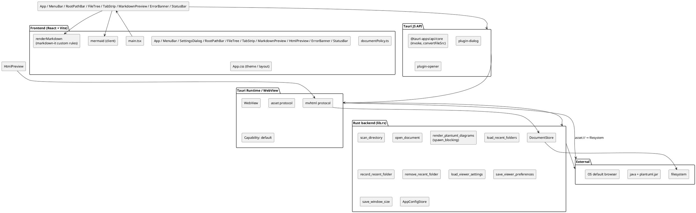
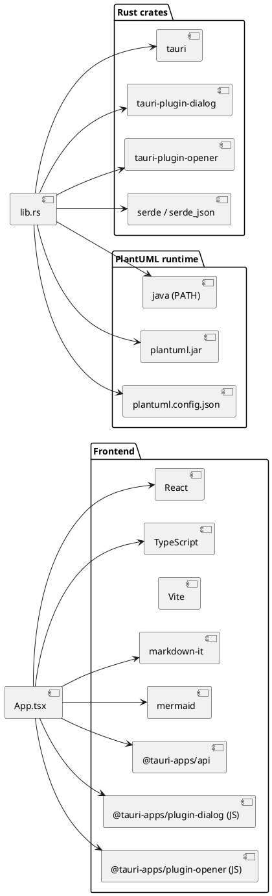
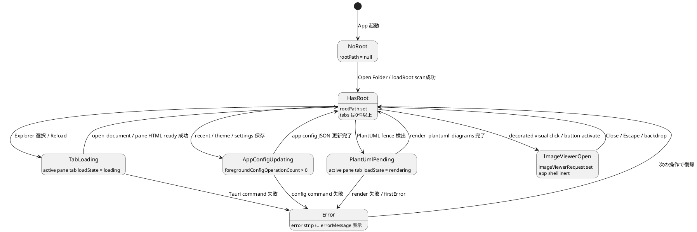

# Tauri Viewer 基本設計

## 基本方針

OS 連携とファイルシステム境界は Rust command / `DocumentStore` へ寄せ、画面状態と Markdown 表示は React 側で扱う。trusted HTMLはRustのroot-scoped protocolからsandboxed iframeへ配信し、React DOMと分離する。Tauri が WebView を提供し、フロントは Vite で組み立てた React アプリ。PlantUML だけは Java プロセスを使うため Rust に集約する。

## 責務

- React: MenuBar dropdown、Settings dialog、Recent Folders、root path strip、幅変更可能なExplorer / Split View、pane-local TabStrip / Preview、error strip、StatusBar、永続 Theme / window resize queue、tab単位とpane単位のエラー / loading、Markdown → HTML 変換、document type別preview。
- CSS layout: Markdown本文はpreview pane content boxから左右gutterを引いた幅とし、固定px最大幅を持たない。trusted HTML iframeはpreview pane全幅を使い、iframe内文書自身のlayoutを上書きしない。
- TypeScript renderer (`renderMarkdown` / `MarkdownPreview`): `markdown-it` のカスタム fence / image / heading ルール。相対画像を `convertFileSrc` 経由で asset URL へ。相対 `.md` リンクをアプリ内遷移へ。MermaidがReact外で置換したSVGを保持するため、生成HTMLと`dangerouslySetInnerHTML`値はMarkdown内容が変わるまで安定化する。
- TypeScript policy (`documentPolicy.ts`): command responseの排他shape、HTML preview URL、opaque-origin messageをpure functionで検証する。
- TypeScript policy (`explorerPane.ts`): Explorer幅の最小値、workspace実寸に応じたdynamic最大値、clamp、keyboard操作をpure functionで管理する。幅はsession-onlyで永続化しない。
- TypeScript policy (`splitView.ts`): single / split、active pane、paneごとのordered tab ID / selection / pending navigation、open / local close / atomic move / root reset、参照集合、generic group resolver、requested ratioとdynamic幅をpure functionで管理する。
- TypeScript policy (`paneRuntime.ts`): pane / tab / revisionのasync結果guardと、共有tab stateとpane-local preview stateからTabStrip表示stateを合成する。
- TypeScript policy (`tabStrip.ts`): tab item全体のhorizontal reveal delta、mouse drag開始threshold、candidate pane IDのdrop target narrowing、pointer座標とTabStrip矩形の境界判定をDOM非依存のpure functionで管理する。
- TypeScript policy / DOM adapter (`imageViewer.ts`): image viewerのfit / zoom / pan / wheel / intrinsic size / activation判定をpure functionへ集約し、Markdown preview内で描画が完了した通常画像、Mermaid SVG、PlantUML SVGだけをtyped requestへ解決する。
- Rust: canonical current root、Markdown / HTML open、`mvhtml` resource配信、PlantUML レンダリング、Recent Folders / Viewer settings の app config JSON 永続化。
- Tauri config: dialog / opener / asset protocol の権限管理とshell CSP。HTML protocol originをcapability remote URLへ追加しない。

## データモデル

`FileTreeNode` は Rust とフロントエンドで camelCase で対応する。

| field | 型 | 補足 |
|---|---|---|
| `name` | string | ファイル / ディレクトリ名 |
| `path` | string | OS絶対パス。Windowsではfrontend境界で`\\?\`を除いた通常形式を返す |
| `relativePath` | string | root からの相対パス |
| `nodeType` | `"directory" \| "markdown" \| "html" \| "image"` | enum |
| `children` | `FileTreeNode[]` | directory のみ非空、Directory→Markdown→HTML→Image の順で整列 |

PlantUML 結果も Rust とフロントエンドで対応する (`PlantUmlRenderResponse` / `PlantUmlDiagramResult`)。

`RecentFolderEntry` は Rust とフロントエンドで camelCase で対応し、保存時点の canonical path を正本とする。Windowsのfilesystem内部ではverbatim pathを維持し、frontend・設定保存・Java process引数の境界で通常のdrive / UNC pathへ変換する。

| field | 型 | 補足 |
|---|---|---|
| `path` | string | canonicalized absolute directory path |
| `name` | string | `record_recent_folder` 実行時に Rust 側で確定した folder name snapshot |
| `lastOpenedAt` | string | Unix seconds を文字列化した最終 open 時刻 |

`OpenDocumentTab` はfrontend内だけの型付きstateで、同一root内のMarkdown / HTMLを保持する。

| field | 型 | 補足 |
|---|---|---|
| `id` | string | App内で単調増加する不透明ID |
| `path` | string | tab collection内で一意な絶対path |
| `displayName` | string | TabStrip / StatusBar表示名 |
| `documentType` | `markdown \| html` | renderer branchの正本 |
| `sourceText` | `string \| null` | MarkdownだけがUTF-8本文を持つ |
| `previewUrl` | `string \| null` | HTMLだけがRust生成URLを持つ |
| `revision` | number | 初回読込 / Reloadごとに増加するasync guard |
| `loadState` | `loading \| rendering \| ready \| error` | tab単位状態 |
| `errorMessage` | `string \| null` | tab単位代表error |
| `plantUmlDiagrams` | `PlantUmlDiagramResult[]` | tab単位のpending / SVG / error cache |

`SplitViewState`は表示layoutとpane-local tab groupの正本であり、`OpenDocumentTab`へpane情報を埋め込まない。同じtab IDはprimary / secondaryの両groupから参照できる。

| field | 型 | 補足 |
|---|---|---|
| `mode` | `single \| split` | 左右2 paneだけを提供する |
| `activePaneId` | `primary \| secondary` | Explorer、Reload、StatusBar、代表errorの対象 |
| `primary` / `secondary` | `PaneState` | paneごとの`orderedTabIds`、group memberである`activeTabId`、active tabに一致するpending anchor。single時もsecondary groupを保持可能 |
| `requestedSplitRatio` | number | 0より大きく1より小さいsession-only指定値。狭幅時のclamp値を書き戻さない |

各group内のIDは一意、nonempty groupのactive tabはnon-nullかつmember、pending navigationのtab IDはactive tabと一致する。Explorer / relative link openはactive group末尾へdedupe追加し、local closeはsource groupだけを更新した後、両groupから参照されないglobal dataだけを破棄する。moveはsource removal / local fallbackとdestination dedupe add / selectを1つのtyped transitionで確定する。split off / onは両groupの所属・順序・選択を変更しない。

`PanePreviewStatus`はMermaid / HTML iframeのDOM固有状態を`paneId + tabId + revision`へ帰属させる。document openとPlantUML結果は共有tab stateのまま維持し、同じtabを両paneへ表示してもread / PlantUML commandを重複させない。

`ViewerSettings` は Rust / TypeScript / app config JSON で camelCase 対応する。

| field | 型 | 補足 |
|---|---|---|
| `theme` | `"light" \| "dark"` | 起動時復元し、View menu / Settings dialog の保存成功後に反映 |
| `windowSize` | `{ width: number, height: number }` | logical size。既定 800 x 600、有効範囲 width 640..10000 / height 480..10000 |
| `plantUmlJarPath` | `string \| null` | canonical absolute jar path。`null` はruntime directory自動探索 |

`ViewerSettingsLoadResult` は`settings`と`warnings`を返す。型として読める範囲外window sizeは既定値へ部分正規化し、Theme / jar path / Recent Foldersを維持する。malformed JSONは`Err`として保存で上書きしない。

## 依存方向

```text
React UI -> Tauri invoke -> Rust commands -> filesystem / Java
React UI -> markdown-it / mermaid -> WebView DOM
React UI -> explorerPane.ts -> Explorer width bounds / keyboard policy
React UI -> splitView.ts / paneRuntime.ts -> pane selection / width / async guard policy
React UI -> imageViewer.ts -> transform policy / Markdown DOM source resolver
React UI -> @tauri-apps/plugin-dialog / plugin-opener -> OS
HtmlPreview -> mvhtml protocol -> DocumentStore -> root内allowlist resource
```

フロント → Rust の方向のみ。Rust 側から JS を呼び出すコールバックは使わず、結果は `invoke` の戻り値で返す。

## コンポーネント図



## 依存パッケージ図



## 状態モデル



## Tauri 設定要点

- `assetProtocol.enable = true` + `scope = ["**"]` で `convertFileSrc` を介した相対画像参照を許可する。
- production / developmentを分けたshell CSPを設定し、HTML frame sourceは`mvhtml:` / `http://mvhtml.localhost`だけを許可する。remote `http(s)` frameは許可しない。
- capability `default` は window `main` に対し `core:default` / `dialog:default` / `opener:default` のみを許可する。
- HTML iframeは`sandbox="allow-scripts"`とresponse CSPを持ち、opaque originとする。root内JSON fetchは`Origin: null`のsimple GETだけを対象とする。
- Recent Folders と Viewer settings は Tauri の app config directory 配下 `settings.json` に保存する。browser `localStorage` は使用しない。
- `settings.json` は sibling temporary file へ全量write / sync後にatomic replaceする。replace 成功をlogical commit pointとし、それ以前の失敗では既存fileを維持する。replace後のdirectory sync失敗はlogical saveを失敗に戻せないためdurability warningとして記録する。
