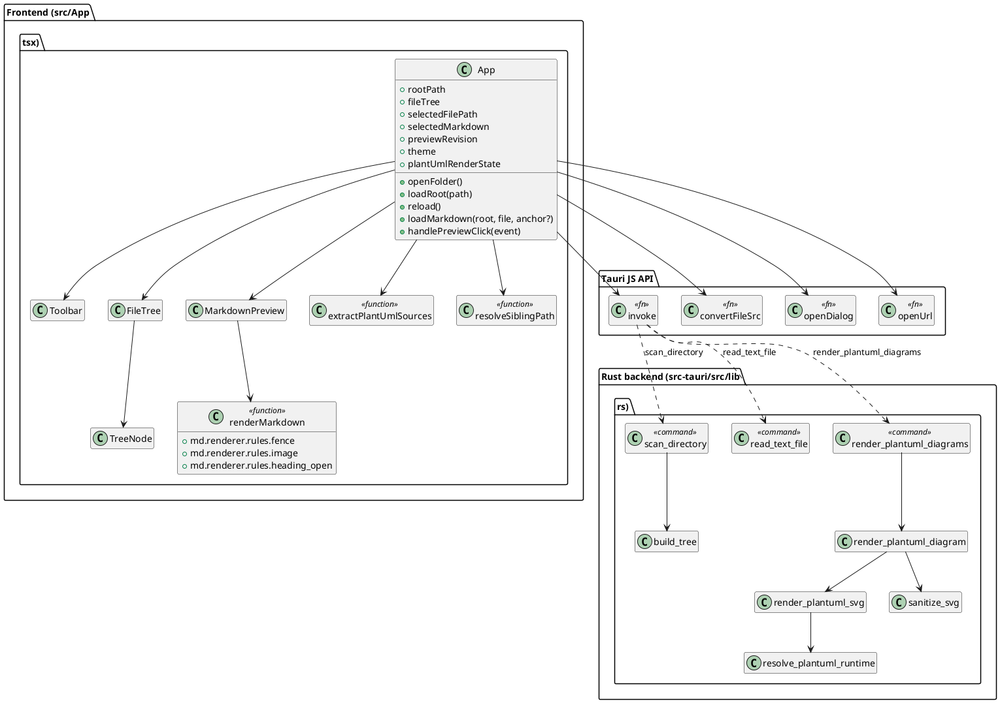
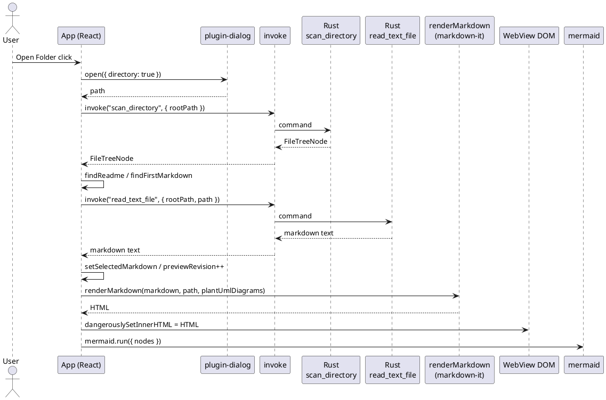
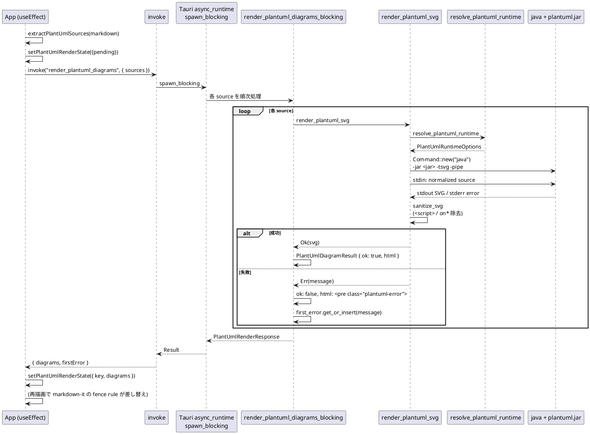
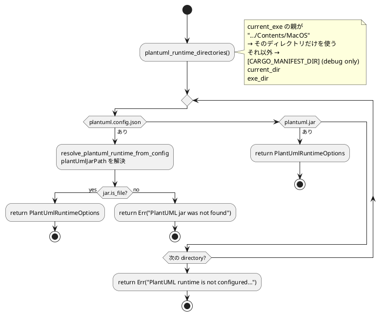
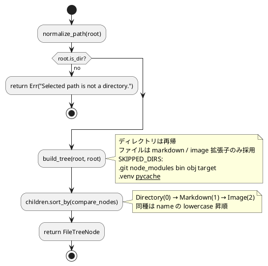

# Tauri Viewer 詳細設計

## 状態管理

`App` (`src/App.tsx`) が React の `useState` で次を保持する。

| state | 役割 | 補足 |
| --- | --- | --- |
| `rootPath` | 選択中フォルダ | `string \| null` |
| `fileTree` | Explorer 用 root ノード | `FileTreeNode \| null` |
| `selectedFilePath` | 表示中 Markdown の絶対パス | `string \| null` |
| `selectedMarkdown` | Markdown 本文 | UTF-8 文字列 |
| `previewRevision` | Reload / 再描画用カウンタ | 同一内容でも increment で再描画 |
| `theme` | `"light" \| "dark"` | `<html data-theme>` に反映 |
| `errorMessage` | エラーバナー表示 | Markdown / PlantUML / Mermaid 失敗の代表メッセージ |
| `pendingAnchor` | 遷移先アンカー | 80ms 遅延でスクロール |
| `isMarkdownLoading` | `read_text_file` 中フラグ | プレビュー上部 loading バナー |
| `isBusy` | `isMarkdownLoading OR isPlantUmlRendering` | Toolbar / Explorer を一時無効化するための aggregate busy フラグ |
| `plantUmlRenderState` | `{ key, diagrams }` | `selectedFilePath:previewRevision` をキーに最新結果を保持 |

`previewRevision` は Markdown 本文が同一でも Reload 時に Mermaid / PlantUML を再描画するための更新番号である。

## クラス / モジュール図



## 処理フロー (Open Folder → Preview)

1. `@tauri-apps/plugin-dialog` の `open({ directory: true })` でフォルダを選択する。
2. `scan_directory` command で Explorer 用ツリーを取得する。
3. `findReadme` → `findFirstMarkdown` の順で初期表示ファイルを決める。
4. Explorer の Markdown 選択時に `read_text_file` command で本文を取得する。
5. `renderMarkdown` (`markdown-it`) で HTML 化する。fence rule で:
   - `mermaid` → `<div class="mermaid">`
   - `plantuml` / `puml` → `plantUmlDiagrams[i].html` (pending / 成功 / エラー)
   - 画像の `src` は `isRelativeResource` を満たす場合に `convertFileSrc` で asset URL に置換し、`loading="lazy"` を付ける。
   - heading は `slugify(name)` を `id` に付与する。
6. `useEffect` が `selectedFilePath` / `selectedMarkdown` / `previewRevision` の変化を検知し、`extractPlantUmlSources` で PlantUML fence を抽出 → `render_plantuml_diagrams` を invoke。pending 中は `.plantuml-loading` プレースホルダで表示し、結果到着で `.plantuml-diagram` / `.plantuml-error` へ差し替える。
7. 別の `useEffect` が `previewRevision` / `theme` / `plantUmlDiagrams` の変化で `mermaid.run` を実行する。`securityLevel: "strict"` を指定。
8. `pendingAnchor` がある場合は 80ms 後に `previewRef` 内のアンカーへスクロールする。



## PlantUML レンダリング

PlantUML 表示は Rust 側の `render_plantuml_diagrams` command で行う。React は Markdown 本文から `plantuml` / `puml` fenced code block を抽出し、source 配列として command へ渡す。Rust command は `tauri::async_runtime::spawn_blocking` 経由で各 source を順次 `java -jar <plantuml.jar> -tsvg -pipe` に渡し、SVG HTML またはエラー HTML を返す。



- タイムアウトは 10 秒。`render_plantuml_svg` 内で `try_wait` ループしつつ 20ms スリープで監視し、超過時は `child.kill()`。stdout / stderr は別スレッドで読み出し、デッドロックを避ける。
- `sanitize_svg` は `<script>...</script>` ブロックの除去と `on*` イベントハンドラ属性の除去を 2 段で行う。
- `assetProtocol` を使うため `convertFileSrc` 経由で相対画像が表示できる。

### PlantUML runtime 解決



- Tauri dev では `markdown-viewer-tauri/src-tauri/` (`CARGO_MANIFEST_DIR`) をランタイムディレクトリとして先に探索する。
- macOS bundle では `<app>.app/Contents/MacOS/` をランタイムディレクトリとし、Finder 起動時の current_dir に依存しない。
- 相対 `plantUmlJarPath` は config file のディレクトリ基準で解決する。

### 再描画方針

- Theme 切替だけでは `render_plantuml_diagrams` を再実行しない。invoke するのは `selectedFilePath` / `selectedMarkdown` / `previewRevision` のいずれかが変わった場合だけ。
- PlantUML 結果待ちの図がある間は、React 側 (`isBusy` / `isPlantUmlRendering`) でプレビュー上部に loading バナーを表示する。Markdown 読み込み中と PlantUML 描画中は併せて `Loading Markdown and rendering PlantUML diagrams...` を表示し、Toolbar / Explorer の操作を無効化して重複レンダリングを防ぐ。
- PlantUML の pending placeholder は `.plantuml-loading` で、最終失敗時のみ `.plantuml-error` を使う。これにより pending 状態と失敗状態が視覚的に区別される。

## ローカル画像

相対画像は `resolveSiblingPath(selectedFilePath, src)` で絶対パスへ解決し、`convertFileSrc` で `asset://` URL へ変換する。`isRelativeResource` で `data:` / `file:` / `http(s)://` / `#anchor` / 絶対パスは対象外とする。

## リンク処理

- `http(s)://` / `mailto:`: `@tauri-apps/plugin-opener` の `openUrl` で OS 既定ブラウザを開く。
- `#anchor`: `previewRef` 内で `scrollIntoView`。
- 相対 `.md` / `.markdown`: `resolveSiblingPath` でパス解決し、`loadMarkdown` で開く。`#anchor` 付きの場合は読み込み後 80ms 遅延でスクロール。

## ファイル走査 (`scan_directory`)



- `read_text_file` は root 配下チェック (`file_path.starts_with(&root)`) + Markdown 拡張子チェックの後、UTF-8 で読み込む。

## エラーハンドリング

| 失敗箇所 | 表示 |
| --- | --- |
| Tauri command 失敗 | `errorMessage` を `error-banner` に表示 |
| Markdown 読み込み失敗 | 同上 + 直前の選択ファイルは維持 |
| Mermaid 描画失敗 | `errorMessage` を `Mermaid render failed: ...` で表示 |
| PlantUML 図単位失敗 | 該当位置に `.plantuml-error`、`firstError` を `errorMessage` にも反映 |
| PlantUML pending | 該当位置に `.plantuml-loading`、`Toolbar / Explorer` を一時無効化して重複操作を抑止 |
| PlantUML タイムアウト (10 秒) | 図単位失敗として表示 |
| `render_plantuml_diagrams` 全体失敗 | 全図を `.plantuml-error` に置換し `errorMessage` を更新 |

## UI レイアウト

`App.tsx` は次の DOM 構造を返す。

```text
<main.app-shell>
  <Toolbar/>           ← Open Folder / Theme / Reload / path
  <section.workspace>
    <aside.explorer-pane>
      <FileTree/>      ← 再帰 TreeNode、Markdown / Image / Directory アイコン
    </aside>
    <section.preview-pane>
      <div.error-banner/>  (errorMessage がある場合)
      <div.loading-banner/> (Markdown / PlantUML 読み込み中)
      <MarkdownPreview/> dangerouslySetInnerHTML
    </section>
  </section>
</main>
```

テーマは `document.documentElement.dataset.theme` に `"light" \| "dark"` を書き込み、`App.css` の `:root[data-theme=...]` で CSS 変数を切り替える。
