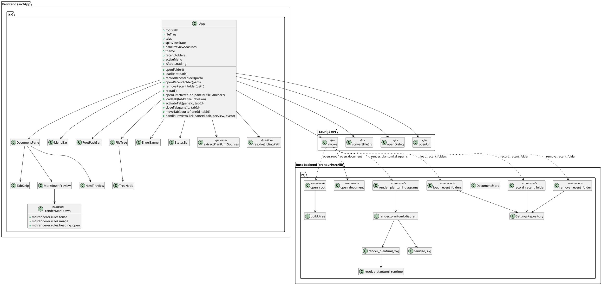
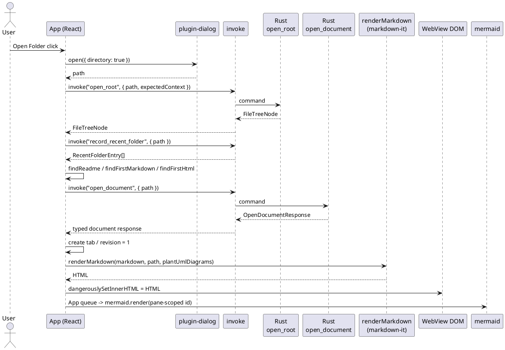
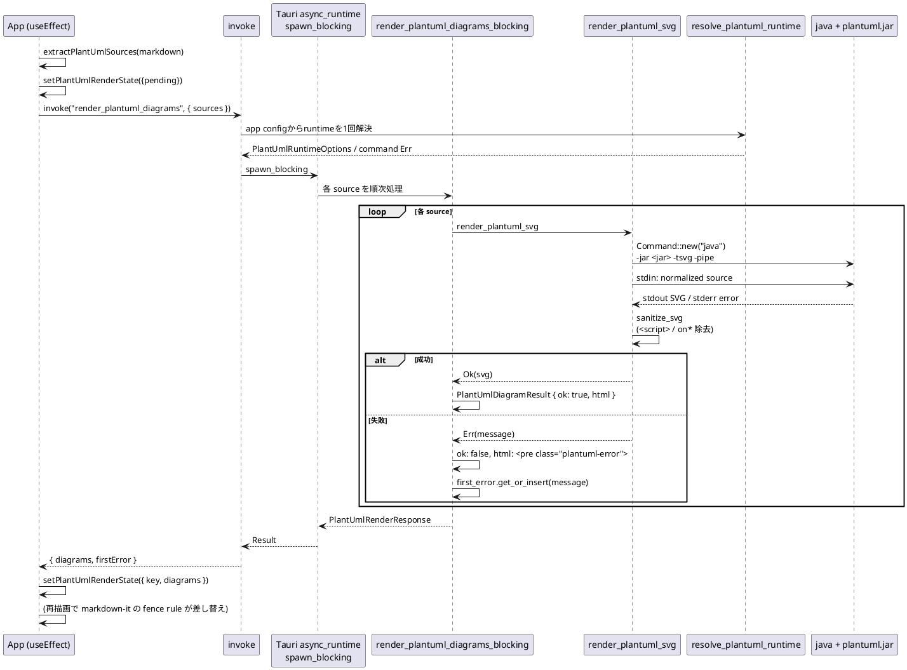
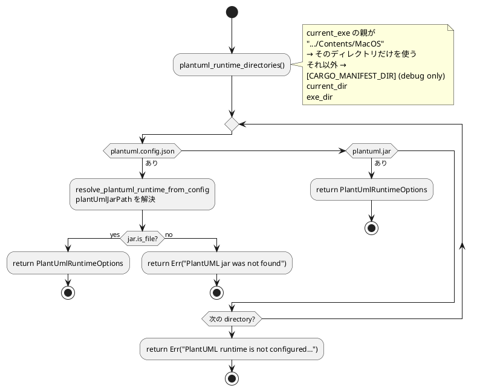
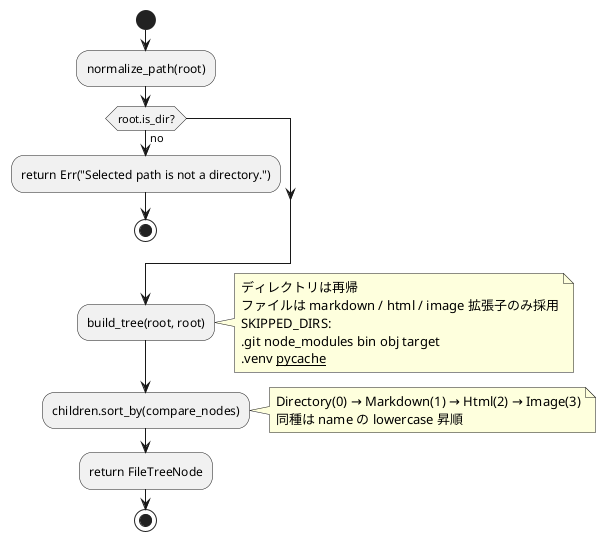

# Tauri Viewer 詳細設計

## 状態管理

`App` (`src/App.tsx`) が React の `useState` で次を保持する。

| state | 役割 | 補足 |
| --- | --- | --- |
| `rootPath` | 選択中フォルダ | `string \| null` |
| `fileTree` | Explorer 用 root ノード | `FileTreeNode \| null` |
| `tabs` | open中Markdown / HTMLと描画cache | `OpenDocumentTab[]`。pathはcollection内で一意 |
| `splitViewState` | single / split、active pane、paneごとのordered tab ID / active tab / pending anchor、requested ratio | `SplitViewState`。pane-local所属・順序・表示選択の唯一の正本 |
| `panePreviewStatuses` | Mermaid / HTML handshakeのpane-local状態 | primary / secondaryごとの`PanePreviewStatus \| null` |
| `theme` | `"light" \| "dark"` | `<html data-theme>` に反映 |
| `rootOperationError` | root / Recent Foldersの代表error | active tab errorより表示優先度が高い |
| `isRootLoading` | root tree scan中フラグ | root collection交換操作のglobal busy |
| `isRecentFoldersBusy` | Recent Folders command 実行中フラグ | app config JSON 読み書き中の重複操作を抑止 |
| `recentFolders` | 最近開いた root folder 一覧 | `RecentFolderEntry[]`。app config JSON から復元 |
| `activeMenu` | 開いている MenuBar dropdown | `"file"` / `"view"` / `null` |
| `requestedExplorerWidth` | 利用者が最後に要求したExplorer幅 | 初期280px。window縮小時の実効clamp後も保持し、再拡大時に復元 |
| `workspaceWidth` | workspace content width | `ResizeObserver`で計測。未計測時は`null` |
| `isExplorerResizing` | Explorer separator drag中フラグ | app shellのselection抑止と`col-resize` cursorに使用 |
| `splitWorkspaceWidth` | PreviewWorkspace content width | Split View幅policy用。未計測時は`null` |
| `isSplitResizing` | Split separator drag中フラグ | Explorer resizeとは独立したpointer lifecycle |
| `isGlobalBusy` | `isRootLoading OR isRecentFoldersBusy` | root競合操作だけを抑止。tab activate / closeは許可 |
| `nextTabIdRef` | tab ID採番 | close後も再利用しない単調増加counter |

各tabの`revision`はReload時に増加し、MarkdownのMermaid / PlantUML再描画、HTML iframe remount、stale async response排除に使う。active tab、error、loading表示は`tabs + splitViewState + panePreviewStatuses`から導出し、旧global `activeTabId` / `pendingNavigation`を並存させない。`splitView.ts`がpane-local group invariant、open / select / local close / atomic move、参照集合、generic resolver、split状態遷移と幅計算を担当し、`paneRuntime.ts`がpane / tab / revision guardとTabStrip表示state合成を担当する。Appはprimary / secondaryのordered IDを`useMemo`でglobal `tabs`へ解決し、missing IDはintegration errorとしてthrowする。

## クラス / モジュール図



## 処理フロー (Open Folder → Preview)

1. `@tauri-apps/plugin-dialog` の `open({ directory: true })` でフォルダを選択する。
2. `open_root` command で Explorer 用ツリーを取得する。
3. `record_recent_folder` command で選択 root を Recent Folders へ保存する。document file が 1 つもない root でも、`open_root` が成功した directory であれば保存対象にする。
4. `findReadme` → `findFirstMarkdown` → `findFirstHtml` の順で初期表示ファイルを決める。
5. 初期documentをloading tabとして作成し、`open_document` commandのdiscriminated responseで分岐する。Markdownは本文を保持し、HTMLはpreview URLだけを保持する。Explorer選択も同じ`openOrActivateTab`を使い、同一pathなら既存tabをactivateする。
6. `renderMarkdown` (`markdown-it`) で HTML 化する。fence rule で:
   - `mermaid` → `<div class="mermaid">`
   - `plantuml` / `puml` → `plantUmlDiagrams[i].html` (pending / 成功 / エラー)
   - 画像の `src` は `isRelativeResource` を満たす場合に `convertFileSrc` で asset URL に置換し、`loading="lazy"` を付ける。
   - heading は `slugify(name)` を `id` に付与する。
7. `loadTab`が`extractPlantUmlSources`でfenceを抽出し、tabへpending placeholderを設定して`render_plantuml_diagrams`をinvokeする。結果は`tabId + revision`一致時だけtab cacheへ反映する。
8. 各`DocumentPane`のeffectがselected tab ID / revision / PlantUML結果 / themeの変化でMermaid taskをApp所有queueへ投入する。queue内で`securityLevel: "strict"`を初期化し、pane / tab / revision / diagram indexを含むIDで`mermaid.render`を直列実行する。
9. paneの`pendingNavigation`がselected tabと一致する場合は80ms後にそのpane内だけをanchor scrollし、pane / tab / revision guard後にclearする。



## PlantUML レンダリング

PlantUML 表示は Rust 側の `render_plantuml_diagrams` command で行う。React は Markdown 本文から `plantuml` / `puml` fenced code block を抽出し、source 配列として command へ渡す。Rust command は app configを読み、全sourceで共有するruntimeをblocking task開始前に1回だけ解決する。runtime / app config解決失敗はcommand全体の`Err`とし、runtime解決後は`tauri::async_runtime::spawn_blocking`経由で各 source を順次 `java -jar <plantuml.jar> -tsvg -pipe` に渡し、SVG HTMLまたは図単位のエラーHTMLを返す。Windowsでは`CREATE_NO_WINDOW`を指定し、Java起動時のterminal windowを表示しない。



- タイムアウトは 10 秒。`render_plantuml_svg` 内で `try_wait` ループしつつ 20ms スリープで監視し、超過時は `child.kill()`。stdout / stderr は別スレッドで読み出し、デッドロックを避ける。
- `sanitize_svg` は `<script>...</script>` ブロックの除去と `on*` イベントハンドラ属性の除去を 2 段で行う。
- `assetProtocol` を使うため `convertFileSrc` 経由で相対画像が表示できる。

### PlantUML runtime 解決



- Tauri dev では `markdown-viewer-tauri/src-tauri/` (`CARGO_MANIFEST_DIR`) をランタイムディレクトリとして先に探索する。
- macOS bundle では `<app>.app/Contents/MacOS/` をランタイムディレクトリとし、Finder 起動時の current_dir に依存しない。
- 相対 `plantUmlJarPath` は config file のディレクトリ基準で解決する。

### 再描画方針

- Theme切替やtab activateだけでは`render_plantuml_diagrams`を再実行しない。invokeするのは新規tab読込またはactive paneのselected tab Reload時だけで、結果をtab単位にcacheする。
- PlantUML結果待ちのtabは`loadState=rendering`とし、activeの場合はStatusBarへ`Rendering PlantUML diagrams...`を表示する。別tabのactivate / close / openは許可するため複数Java processが並行し得るが、MVPでは上限・queueを設けずPhase 4で体感を確認する。
- PlantUML の pending placeholder は `.plantuml-loading` で、最終失敗時のみ `.plantuml-error` を使う。これにより pending 状態と失敗状態が視覚的に区別される。

## ローカル画像

相対画像は`resolveSiblingPath(activeTab.path, src)`で絶対パスへ解決し、`convertFileSrc`で`asset://` URLへ変換する。`isRelativeResource`で`data:` / `file:` / `http(s)://` / `#anchor` / 絶対パスは対象外とする。

## Markdown image viewer

- `createImageViewerDomAdapter`は各selected Markdown previewを走査し、load済み通常画像、描画済みMermaid SVG、`.plantuml-diagram > svg`へ同一opaque IDのvisual markerとnative keyboard buttonを付与する。pending / error / invalid sizeは操作対象にしない。
- keyboard buttonは通常時visually hiddenかつ文書flow外とし、focus時だけ対象visual右上へfixed pillとして表示する。通常画像は`img`直後、linked imageは`a`直後、diagramはcontainer直後へ挿入して既存layoutとnested interactive回避を両立する。
- `resolveImageViewerSource`はactive preview root内のID一致visual / buttonが各1個の場合だけ`ImageViewerRequest`を返す。SVG内anchorは既存link処理を優先し、linked imageの画像領域clickはviewerを優先する。
- `ImageViewerDialog`は描画済みvisualを`cloneNode(true)`し、app shellのsiblingに表示する。app shellは`inert`となる。requestに発生元paneを付加し、close後はkeyboard起点ならbutton、pointer起点なら発生元Markdown previewへfocusを戻す。復帰先がdetach済みならprimary paneへfallbackする。
- 初期scaleは左右上下padding内へ収まる`min(1, availableWidth / intrinsicWidth, availableHeight / intrinsicHeight)`。下限は現在のfit、上限は8.0。toolbar / wheel / keyboardは同じpolicyを利用し、drag / Arrow keyのpanをbounds内へclampする。
- viewer stateはtabへ永続化せず、close、発生元paneのtab / revision / document type変更、tab close、split offによるpane unmountで破棄する。ResizeObserverはfit modeを再fitし、custom modeはscaleを維持してoffsetを再clampする。

## Multi-tab処理

- `OpenDocumentTab`はdocumentType、Markdown sourceまたはHTML preview URL、revision、loadState、error、PlantUML結果を保持する。
- `PaneState.orderedTabIds`はpane-local所属と挿入順を保持し、同じIDのprimary / secondary両group参照を許可する。nonempty groupのactive tabは必ずmemberであり、pending navigationはactive tabと一致する。
- 新規openはglobal dataを作成し、active pane group末尾へ追加・選択する。同一pathはdataを重複せず、そのpane groupへdedupe追加・選択する。
- local closeはsource groupだけからIDを外し、activeならsource local順の右、なければ左へfallbackする。reducer適用後の両group参照集合がemptyの場合だけglobal dataを削除する。
- moveはsource removal / fallbackとdestination dedupe add / selectを`move-tab` actionでatomicに更新する。destinationに同じIDがある場合は既存位置を維持し、move後はdestination tabへfocusする。
- 各paneのTabStripはlocal viewだけを40px固定高の1行tabとして描画し、上端state indicator、横overflow、item全体と進行方向の隣接tab 50%を対象にしたmanual reveal、roving tabindex、ArrowLeft / ArrowRight / Home / Endを提供する。先頭 / 末尾または幅不足時は選択item全体を優先する。split時はactive tabのpane間move buttonに加え、mouseでactive / non-active tabを反対paneのTabStripへdragできる。いずれも既存`move-tab` transitionへ接続する。
- split off / onは両groupの所属・順序・active tabを変更しない。singleでprimaryがempty、secondaryだけがnonemptyならhidden件数と`Enable Split View`案内を表示する。
- Reloadはtree scan成功後、active paneのselected tabの同じIDでrevisionを増やし、旧content / URLをclearして再openする。共有tab revisionにより同じtabを表示する両paneが再描画される。
- root scan成功をcommit pointとし、成功後に旧tabsを破棄して両pane選択をclearする。split mode / requested ratioは維持し、初期文書はprimaryへ開く。scan失敗時は旧root / tabs / pane stateを維持する。
- document responseは`tabId + revision`、pane DOM結果は`paneId + tabId + revision`でguardし、close済み、Reload前、旧root、unmount済みpaneの結果を無視する。
- pane preview statusのclearは`isPanePreviewStatusCurrent`を使うgeneric effectだけが行う。open / close / move / Reload / root reset / split toggle handlerは独自clearを持たない。

## リンク処理

- `http(s)://` / `mailto:`: `@tauri-apps/plugin-opener` の `openUrl` で OS 既定ブラウザを開く。
- `#anchor`: `previewRef` 内で `scrollIntoView`。
- 相対 `.md` / `.markdown`: `resolveSiblingPath` でパス解決し、`openOrActivateTab`で既存tabを再利用または新規openする。`#anchor`はApp/pane-levelの`pendingNavigation`から読み込み後80msでscrollする。

## trusted HTML preview

- `DocumentStore`は`RwLock<Option<RootSnapshot {path,generation}>>`を正本とする。成功したopen_rootで両fieldを同時commitし、document / protocolはsnapshotをcloneしてlock解放後にそのpathでI/Oする。context照合も同じsnapshotを使う。
- HTML URLはRustがroot-relative segmentを個別percent-encodeして生成し、absolute filesystem pathをWebViewへ公開しない。`convertFileSrc`はMarkdown asset imageだけに使う。
- protocolは`/document/<generation>/`（世代不一致410、未指定400）、segment decode、separator / dot / drive注入、canonical root、symlink、regular file、固定MIME allowlistを検証する。GET / HEAD以外は405、root未設定409、invalid 400、root外403、missing 404とする。
- HTML responseへCSPとbridgeを注入する。各paneのiframeは`sandbox="allow-scripts"`だけを持ち、bridgeの`ready`が5秒以内にsource / opaque origin / pane selection / revision policyを通った場合だけpane runtimeをreadyにする。
- `openExternal`は発生paneのiframe source、`Origin: null`、exact shape、ready済み、transient user activation、pane-local duplicate guard、`http(s)` URLを満たす場合だけOS browserへ渡す。active paneであることはsecurity条件にしない。
- HTML branchではMarkdown変換、Mermaid effect、PlantUML commandを実行しない。Theme変更だけではiframeをremountしない。
- `MarkdownPreview`は`renderMarkdown`結果だけでなく`dangerouslySetInnerHTML`へ渡すobjectもHTML単位でmemoizeする。Mermaidは初期source nodeをReact外でSVGへ置換するため、window size保存やExplorer操作による無関係なApp再描画で元HTMLを再注入しない。Markdown / PlantUML結果 / path変更時は新しいHTMLを注入し、Theme / revision変更時は既存keyとMermaid effectにより再描画する。

## ファイル走査 (`open_root`)



- `open_document` はcurrent root配下のregular Markdown / HTMLだけをUTF-8で検証し、排他的な`sourceText` / `previewUrl` responseを返す。

## Directory Settings / Recent Folders

`ViewerSession`がプロセス内操作gateとin-memory settingsを所有する。`SettingsRepository`はglobalとprojectのJSONを読み、固定sidecar settings.lockをFile::try_lockで最大2秒待つ。ファイルI/O・scan・lock待ち・spawn待ちはasync commandからspawn_blockingへ移し、native操作だけmain threadへdispatchする。

```text
<app_config_dir>/settings.json                    # schemaVersion:2, defaultSettings, recentFolders
<app_config_dir>/settings.lock
<app_config_dir>/projects/<sha256>/settings.json  # schemaVersion:1, rootPath, settings
<app_config_dir>/projects/<sha256>/settings.lock
```

SHA-256はdomain + platform + canonical絶対UTF-8 pathから作る。symlinkは実体に収束し、同名異pathは別project。caseを一律変換しない。保存rootPath不一致はerror。rename / 移動時は新projectとして扱う。

初回project openではtree準備成功後にglobal defaultsをsnapshotして生成する。global / project lockは同時保持せず、初回作成競合はlock内で再確認する。既存project openはglobal破損時も可能。current project fileの削除はmissingConfigとし、明示openまで再生成しない。

旧schemaのviewerSettingsをdefaultSettingsへ移しrecentFoldersを保持する。未知schema・不正JSONは上書きせず、対象pathをerrorへ含める。旧版は新版globalを上書きしてdefaultsを無音で失うため混在起動は非対応。復旧は全Viewer終了後にユーザーが該当JSONを退避して再起動 / folder openする。

read-modify-write全体を固定sidecar lockで直列化し、field単位patchを最新JSONへ適用する。既存のtemp write / sync / atomic replaceをgeneric helperとして再利用する。replace前の失敗は旧file保持、replace後のdirectory sync失敗は保存成功+stderr durability warning。lock fileはreplace / unlinkしない。同fieldは最後の保存が有効で、別fieldは失わない。

Recentは最大10件をcanonical pathでdedupeし、record成功時に先頭へ移す。Fileメニューを開く時に最新履歴を読む。存在しないfolderは明示削除まで残す。

## Viewer Settings / Root Transition

再起動直後はglobal defaults、folder open時にdirectoryのtheme / window size / jarへ切り替わる。session自動復元はしない。Settings dialogは対象Rootを表示し、open時に最新fileを読む。Saveは変更fieldだけpatchし、jar Clearだけ明示nullを送る。Theme操作もthemeだけを送る。背景shellのinert / focus管理は維持する。

`SettingsQueue`が保存を直列化し、resizeを500ms debounceする。Root切替開始時はbusyを同期設定して旧resizeをflushする。旧保存失敗はwarningで続行し、candidate scan / 設定失敗だけ切替を中止する。commit後にcontextを交換し旧pendingを破棄する。document / render結果はcontextとtab revisionで古い結果を捨てる。

startup / Root open / Retryのnative title / sizeはRustから適用し、実測size・sizeApplied・specialStateを返す。Reactはその間のresizeを捨て、実測baselineと異なる利用者resizeだけを保存する。イベントの古いpayloadではなく最新getter値を使う。maximized / minimized / fullscreenではsize適用・保存をせず、通常状態に戻る最初の値はbaselineにするだけ。

PlantUMLは現在sessionのin-memory jar設定を実行開始時にsnapshotする。fileの再読込はfolder open / Settings open / Reload / patch時だけ。実行中jobのruntimeは変更しない。明示jar無効時の自動探索fallbackは禁止し、Clear時だけruntime directory探索へ戻る。

## Multi-instance / macOS Window Menu

1プロセス1main windowを維持する。New WindowはmacOS bundle内ではcurrent_exe由来の絶対bundleへopen -n -aを実行し、dev / Windows / Linuxではcurrent_exeをspawnする。親が終了しても子をkillしない。dev子の表示はVite serverに依存する。

native titleはRoot名と親path、未選択はNo Folder。macOSはTauri標準App / File / Edit / View / Window / Helpの操作を維持し、FileのNew Windowと独自Window submenuのinstance一覧を追加する。予約Window IDを使わず、AppKit自動一覧と二重化しない。checkは常に自instanceだけ、重複labelにUUID suffixを付け安定sortする。

mode0700の`/tmp/mv-<uid>-<appid hash>/`にUUID socketを作る。0700 / owner / 非symlinkを確認し、16KiBのlength-prefixed JSONでInfo / Activateだけを扱う。Infoは250ms、一覧全体2秒・並列8件、listenerも同時8件。起動 / Root変更 / focus / Refreshで更新し、到達不能時はpartial表示。接続拒否・不存在だけをstaleとして削除しtimeoutでは削除しない。

macOS 14以降はrequesterがyieldActivationを行い、さらにtargetのactivateFromApplication(options: ActivateAllWindows)を実行してからtargetへActivateを送る。targetはunhide / deminiaturize完了待ち / makeKeyAndOrderFront / activateを行い、key・active・onActiveSpaceを確認してackする。全体2秒を超えたらerror。14未満はAPI availabilityのため旧APIを用いるが、14以降の失敗からfallbackしない。

native errorはRust queueのid/messageをdrainして既存ErrorBannerへ表示する。capabilityはmain限定を維持し、HTML originへ権限を追加しない。close / Quitは当該processのみ。Dock / Cmd+Tabでの単一icon集約やCmd+`でのprocess間巡回は保証しない。

## エラーハンドリング

| 失敗箇所 | 表示 |
| --- | --- |
| Tauri command 失敗 | `errorMessage` を StatusBar 直上の error strip に表示 |
| Markdown / HTML open失敗 | 同上。global tabをerrorにし、選択中のpaneで表示する |
| HTML ready timeout | 5秒で発生pane runtimeだけをerrorにし、iframe eventを成功判定に使わない |
| HTML resource / CSP failure | iframe内resource failureとして分離し、shellは維持する |
| Recent Folders 読み書き失敗 | error strip に表示。missing path は自動削除しない |
| Settings validation / 保存失敗 | Settings dialog内の`role="alert"`へ表示し、draftを維持 |
| startup / background window size保存失敗 | error stripに表示。malformed configは自動上書きしない |
| Mermaid 描画失敗 | 発生pane runtimeへ帰属させ、active paneならerror stripに表示 |
| PlantUML 図単位失敗 | 該当位置に `.plantuml-error`、`firstError` を `errorMessage` にも反映 |
| PlantUML pending | 該当位置に `.plantuml-loading`、`MenuBar / Explorer` を一時無効化して重複操作を抑止 |
| PlantUML タイムアウト (10 秒) | 図単位失敗として表示 |
| `render_plantuml_diagrams` 全体失敗 | 全図を `.plantuml-error` に置換し error strip を更新 |

## UI レイアウト

`App.tsx` は次の DOM 構造を返す。

```text
<main.app-shell>
  <MenuBar/>           ← File操作、View: Theme / Split View / Debug Information
  <RootPathBar/>       ← root path。未選択時は No folder selected
  <section.workspace>
    <aside#explorer-pane.explorer-pane>
      <div.pane-title/>
      <div.explorer-scroll>
        <FileTree/>      ← 再帰 TreeNode、disclosureとtyped inline SVG icon
      </div>
    </aside>
    <div.explorer-separator role="separator"/> ← pointer / keyboard resize、ARIA値
    <section#preview-workspace.preview-workspace>
      <div.preview-grid.single|split>
        <section#document-pane-primary.document-pane role="region">
          <TabStrip/> + <div#document-preview-primary.preview-pane/>
        </section>
        <div.split-separator role="separator"/>  ← split時・計測後だけ表示
        <section#document-pane-secondary.document-pane role="region">...</section>
      </div>
    </section>
  </section>
  <ErrorBanner/>       ← 代表 error。エラー発生時のみ表示
  <DebugPanel/>        ← Viewで有効化した時だけprovider別の複数行診断を表示
  <StatusBar/>         ← File / State
</main>
<SettingsDialog/>      ← modal。Theme / window size / PlantUML jar path
```

`MenuBar` は React アプリ内の window-top menu として扱う。`File` / `View` は native button の menu trigger であり、`aria-haspopup="menu"` / `aria-expanded` を持ち、click で `role="menu"` の dropdown を開く。`File` dropdown は `Open Folder...`、Recent Folders list、`Reload`、separator、`Settings...`を持ち、`View` dropdown はtheme切替、`role="menuitemcheckbox"`のSplit View切替、Debug Information切替を持つ。Settingsはapplication-wideな操作であり、dialog close後はFile triggerへfocusを戻す。dropdown 内の実行 item は `role="menuitem"`、layout wrapper は `role="none"` とする。`role="menubar"` は矢印キー移動・roving tabindex と併せて導入すべき ARIA pattern であるため、今回の最小範囲では使わない。outside click と Escape で dropdown を閉じる。矢印キー移動とフォーカストラップは導入しない。

`RootPathBar` は MenuBar 直下に root path を常時表示し、長い path は ellipsis と `title` で全文確認できる。Explorer幅は`explorerPane.ts`のpure policyで180pxからworkspace実寸に応じたdynamic最大幅へclampし、`ResizeObserver`によるwindow追従とpointer captureによるdragを`App`が調停する。Split Viewは`splitView.ts`でpreferred minimum 240px、separator 6px、16px keyboard stepを扱い、狭幅時の実効clampをrequested ratioへ書き戻さない。各`DocumentPane`はAppで解決済みのpane-local ordered tab viewを受ける`TabStrip`とtabpanelを持ち、active paneはaccent枠で示す。split時のtab itemはactivate / move / closeの3列とminimum 160pxを使い、single時はactivate / closeの2列を使う。TabStrip rowは40px固定高とし、ready / loading / rendering / errorを上端indicatorとaccessible name / `aria-busy`で示す。horizontal scrollbarはWebKit pseudo-elementの6px transparent trackを常時確保し、scroll elementを同じ40pxの`tab-strip-shell`で包む。shell enterでpointer ref / stateを同期更新し、window captureのpointermoveは最新座標をrefへ保持してanimation frameごとに最大1回shell矩形と比較する。shell leaveでは保留中のpointer同期frameと座標を破棄してからclearし、領域外move、window blurでもclearする。keyboard modalityはwindow keydown / pointerdownから明示管理し、shell内focus時だけkeyboard stateを有効にする。pointer stateまたはkeyboard stateのORをpure policyで求め、単一の`tab-scrollbar-visible` classだけをthumb表示条件に使う。UAの`:hover` / `:focus-visible` heuristicは使わない。WebKitでnative thumbが以前のpaintを保持するため、表示policyまたはtab数変更後の次frameにoverflow時だけlayoutとthumb computed styleを1回読み、class transitionを明示的にflushする。focus時は`preventScroll`を使い、`tabStrip.ts`のmanual deltaでitem外枠全体と見切れ方向の隣接item 50%をrevealする。先頭 / 末尾または幅不足時は選択item全体を優先する。mouse dragはpointer capture中も`elementFromPoint`で反対paneのTabStripを判定し、pointerup座標で再確認して明示destination付き`move-tab`を1回だけ適用する。previewはApp shell siblingのfixed layer、pointer座標はref / DOM transformで管理し、Escape / cancel / lost capture / split解除ではstateを変えずcleanupする。Explorer、Reload、StatusBar、代表errorはactive paneを対象とする。`ErrorBanner`は`role="alert"`、StatusBarの`State`とdrag結果だけを`aria-live="polite"`とする。

`html` / `body` / `#root` / `.app-shell` / `.workspace` は全体 overflow を隠し、アプリ外枠にはスクロールバーを出さない。Explorer titleは固定し、treeの縦横scrollは`.explorer-scroll`、documentのscrollは`.preview-pane`へ限定する。`.file-tree`と`.tree-row`は`width: max-content; min-width: 100%`を併用し、短いtreeのrow背景をpane端まで維持しながら、深い階層・長い名前で必要な場合だけ水平scrollを発生させる。tree rowはdisclosure / type icon / labelの3列を共通利用し、labelはellipsisしない。MenuBar / RootPathBar / ErrorBanner / DebugPanel / StatusBar は固定chrome領域として扱う。条件付きのErrorBannerとDebugPanelを含め、CSS gridの自動配置に依存せず`grid-row`で各行を明示する。DebugPanelは通常OFFでlayoutへ参加せず、ON時だけ最大180px、内部scroll可能な複数行領域として表示する。providerのupdate / remove eventを汎用に処理し、表示器は個別provider IDを判定しない。

Markdown本文の`.markdown-body`は、固定px最大幅を持たず、containing blockである各`.preview-pane`のcontent boxを基準に`calc(100% - 48px)`で幅を決め、`margin: 0 auto`で左右24pxのgutterを確保する。window viewportが760px以下の場合だけ既存media queryにより`calc(100% - 28px)`へ切り替え、左右gutterを14pxとする。本文widthの基準はpaneだがgutterのbreakpointはwindow viewportであるため、viewportが760px超のままsplitで個別paneだけが狭くなっても24pxを維持する。table、code block、Mermaid、PlantUMLは必要時の要素内横scroll、imageとPlantUML SVGは`max-width: 100%`による縮小を維持する。MermaidはApp所有queueで直列描画し、paneを含むrender IDを指定する。trusted HTML iframeはpane全幅を使い、iframe内文書自身の`width` / `max-width`はViewerから上書きしない。

テーマは `document.documentElement.dataset.theme` に `"light" \| "dark"` を書き込み、`App.css` の `:root[data-theme=...]` で CSS 変数を切り替える。

## Gate保持と再接続

open / Reloadはcandidateの走査・設定I/Oからcommitまでsession gateを保持する。UIがbusyである期間の直列化を優先し、競合openの敗者が設定を先に生成することや、準備中のsettings更新との再照合を増やさないためである。処理はspawn_blocking上にあり、IPC Info / Activateはgateを取らないので他Viewerへの切り替えを妨げない。

WebView再読込のstartupは現在Root pathとtreeをcontextと共に返す。tree読込失敗はwarningとしRoot表示・設定対象は保持する。native menuはIPC初期化の前に設置し、IPC失敗時は一覧をunavailable表示にする。acceptの一時的エラー（EMFILE / ECONNABORTED等）は100ms backoffで再試行し、回復不能時は再起動案内とunavailable表示を出す。
