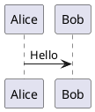
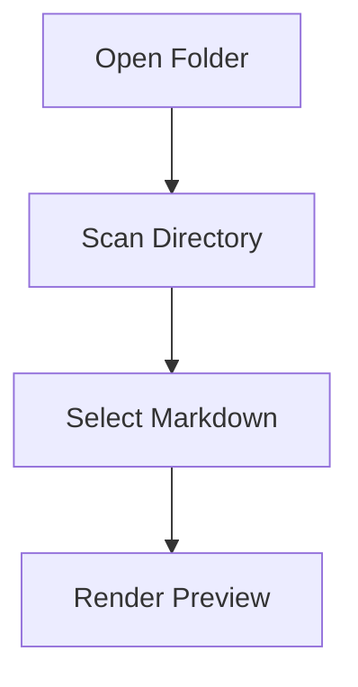
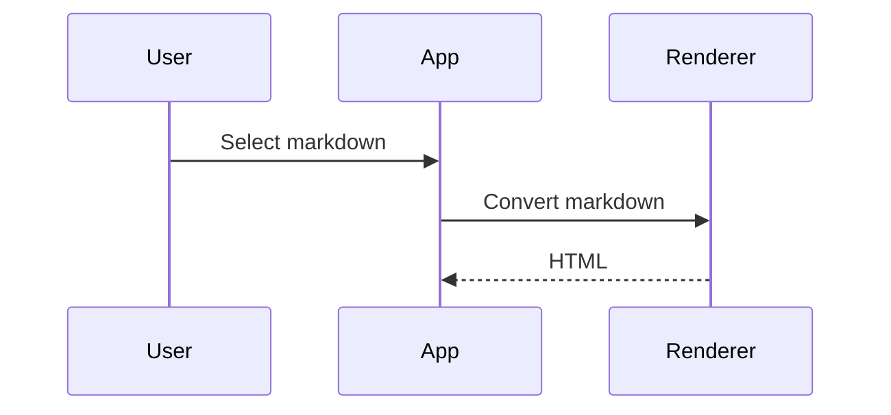

# Markdown Viewer MVP 比較実装 設計ドキュメント

## 目的

VSCode + コーディングエージェント（Codex / Claude / GitHub Copilot）でソフト開発を行う際に、Markdown ドキュメントを表示専用で素早く閲覧するための軽量 Markdown Viewer を試作する。

本ドキュメントは、以下 2 案を同じ要件・同じ評価観点で MVP 実装し、どちらを本格採用するか比較するための、コーディングエージェント向け設計指示書である。

1. Tauri v2 + TypeScript + React
2. Avalonia UI + C# + NativeWebView

---

## 背景と課題

現在は VSCode 拡張の Markdown Preview Enhanced 等で Markdown を閲覧しているが、以下の不満がある。

- Markdown ファイルを開いてからプレビューを開く必要があり、表示までに手間がある。
- 別の md ファイルを開くとプレビュー対象も切り替わることがあり、固定ビューアとして使いづらい。
- 自分で Markdown を編集する用途ではなく、コーディングエージェントが生成・更新した設計書、議事録、README、調査メモ等を読む用途が中心。
- Mermaid / PlantUML を含む開発ドキュメントを、VSCode とは独立した表示専用アプリで確認したい。

---

## 共通 MVP 要件

### 必須要件

| ID | 要件 |
|---|---|
| R1 | アプリ起動後、ディレクトリを選択して開ける |
| R2 | 選択ディレクトリ配下を VSCode 風の Explorer ペインで表示する |
| R3 | Explorer から `.md` / `.markdown` ファイルを選択できる |
| R4 | 選択した Markdown を右ペインにレンダリング表示する |
| R5 | Markdown 内の画像相対パスを表示できる |
| R6 | Markdown 内のリンクを扱える。相対 md リンクはアプリ内遷移、外部 URL は既定ブラウザで開く |
| R7 | Light / Dark テーマを切り替えられる |
| R8 | macOS / Windows で最低限動作する構成にする。Linux は可能なら確認する |

### MVP では後回しでもよい要件

| ID | 要件 |
|---|---|
| L1 | PlantUML 描画 |
| L2 | 全文検索 |
| L3 | 複数タブ |
| L4 | ファイル変更監視による自動再読み込み |
| L5 | `.gitignore` 反映 |
| L6 | 最近開いたフォルダ履歴 |
| L7 | サイドバー幅やテーマの永続化 |
| L8 | パッケージング / インストーラ作成 |

### 比較用 MVP の到達目標

比較のため、2 案とも以下までは実装する。

- フォルダ選択
- ファイルツリー表示
- Markdown 選択
- Markdown → HTML 表示
- GitHub Flavored Markdown 相当の基本表示
- Mermaid コードブロックの表示
- Light / Dark テーマ切替
- 相対画像表示
- 相対 md リンク遷移
- 外部リンクを OS 既定ブラウザで開く

PlantUML は MVP の必須にはしない。ただし設計上、後から追加できるようにインターフェースだけ意識する。

---

## 共通 UI 仕様

### 画面構成

```text
+---------------------------------------------------------------+
| Toolbar                                                       |
| [Open Folder] [Theme: Light/Dark] [Reload] [Current Path]     |
+--------------------------+------------------------------------+
| Explorer Pane            | Markdown Preview Pane               |
|                          |                                    |
| root/                    | # Selected Markdown                 |
|   README.md              |                                    |
|   docs/                  | rendered HTML                       |
|     design.md            | Mermaid diagrams                    |
|     memo.md              | code blocks                         |
|   src/                   | tables / images / links             |
|                          |                                    |
+--------------------------+------------------------------------+
```

### Explorer Pane

- 左側固定ペイン。
- 初期幅は 280px 程度。
- ディレクトリは展開/折りたたみ可能。
- 表示対象:
  - ディレクトリ
  - `.md`
  - `.markdown`
  - 画像ファイル（表示目的では必須ではないが、リンク解決には必要）
- MVP では `.git`, `node_modules`, `bin`, `obj`, `target`, `.venv` などはデフォルトで非表示にしてよい。
- ファイル名クリックで右ペインに表示。
- 選択中ファイルをハイライト表示。

### Markdown Preview Pane

- 右側メインペイン。
- Markdown を HTML として表示。
- CSS で本文幅を制御する。
  - 推奨: `max-width: 980px`
  - 左寄せ or 中央寄せは設定で切替可能にしてもよいが、MVP では中央寄せでよい。
- コードブロックは横スクロール可能。
- Mermaid 図は SVG として描画。
- リンククリック:
  - `http://` / `https://`: OS 既定ブラウザで開く
  - `./xxx.md` / `../xxx.md`: アプリ内で該当 Markdown に遷移
  - `#anchor`: 同一 Markdown 内スクロール
- 画像:
  - `` のような相対パスを表示する。
  - 表示幅は `max-width: 100%`。

---

## 共通データモデル

### FileTreeNode

```ts
type FileTreeNode = {
  name: string;
  path: string;       // absolute path or app-internal normalized path
  relativePath: string;
  type: "directory" | "markdown" | "image" | "other";
  children?: FileTreeNode[];
};
```

C# 版では以下相当。

```csharp
public enum FileNodeType
{
    Directory,
    Markdown,
    Image,
    Other
}

public sealed class FileTreeNode
{
    public required string Name { get; init; }
    public required string Path { get; init; }
    public required string RelativePath { get; init; }
    public required FileNodeType Type { get; init; }
    public List<FileTreeNode> Children { get; init; } = new();
}
```

---

# 案1: Tauri v2 + React + TypeScript

> 2026-07-19仕様更新: Tauri版はMarkdownに加え、選択root内のtrusted UTF-8 `.html`仕様書をdocumentとして扱う。HTML sourceはfrontendへ返さず、Rust `DocumentStore`が生成するroot-relative `mvhtml` URLを`sandbox="allow-scripts"`のiframeへ渡す。custom protocolはcanonical root、resource allowlist、CSP/CORSを強制し、HTML protocol originへTauri capabilityを付与しない。外部linkはiframe bridgeとfrontend policyで検証したuser-clicked `http:` / `https:`だけをOS browserへ渡す。`.htm`、untrusted / 非UTF-8 HTML、root外・external network resourceは対象外である。詳細は`docs/components/tauri_viewer/`を正とする。

## 採用目的

Tauri 版は、軽量なクロスプラットフォーム Markdown Viewer としての適性を確認するために実装する。

Tauri は OS 標準 WebView を使うため、Electron より軽量な配布物を期待できる。Web UI をそのまま使えるため、Markdown / Mermaid / CSS テーマとの相性が良い。一方で、Rust / Tauri 固有の知識が必要になるため、学習コストとエージェント実装の安定性を評価する。

---

## 技術スタック

| 領域 | 採用技術 |
|---|---|
| アプリ基盤 | Tauri v2 |
| バックエンド | Rust |
| フロントエンド | React + TypeScript |
| ビルド | Vite |
| Markdown パーサ | markdown-it |
| Mermaid | mermaid |
| コードハイライト | MVP では任意。余裕があれば Shiki |
| スタイル | CSS Modules または通常 CSS |
| フォルダ選択 | `@tauri-apps/plugin-dialog` |
| ファイル読み込み | Rust command または `@tauri-apps/plugin-fs` |
| 外部リンク | `@tauri-apps/plugin-opener` または Rust command |

---

## 想定プロジェクト構成

```text
markdown-viewer-tauri/
  package.json
  vite.config.ts
  index.html
  src/
    main.tsx
    App.tsx
    styles/
      app.css
      markdown.css
      theme.css
    components/
      Toolbar.tsx
      ExplorerPane.tsx
      FileTree.tsx
      MarkdownPreview.tsx
    markdown/
      renderMarkdown.ts
      renderMermaid.ts
      linkHandler.ts
    types/
      fileTree.ts
  src-tauri/
    Cargo.toml
    tauri.conf.json
    src/
      main.rs
      commands/
        mod.rs
        file_tree.rs
        read_markdown.rs
```

---

## Tauri 実装方針

### Rust 側 Command

#### `scan_directory(root_path: String) -> Result<FileTreeNode, String>`

選択されたディレクトリを走査し、Explorer 表示用のツリーを返す。

要件:

- 再帰的にディレクトリを走査する。
- 以下はスキップする。
  - `.git`
  - `node_modules`
  - `bin`
  - `obj`
  - `target`
  - `.venv`
  - `__pycache__`
- Markdown ファイルは `type = "markdown"`。
- 画像は `type = "image"`。
- その他ファイルは MVP では返さなくてもよい。返す場合は `other`。
- ディレクトリ → Markdown → その他の順にソート。
- 大きいディレクトリで固まらないよう、MVP 後に遅延ロードへ変更できるように関数を分ける。

#### `read_text_file(path: String) -> Result<String, String>`

Markdown ファイルを UTF-8 テキストとして読み込む。

要件:

- 選択した root 配下のファイルのみ読めるようにする。
- MVP では root の検証が面倒であれば、最低限 path traversal に注意し、後続タスクとして残す。
- UTF-8 以外はエラー表示でよい。

#### `resolve_asset(path: String)`

画像ファイルの表示については、以下のどちらかを選ぶ。

案A: Tauri の asset protocol / convertFileSrc を使う  
案B: Rust command で画像を base64 data URL にして返す

MVP では簡単な方でよい。Tauri ではローカルファイル URL を WebView に安全に渡す方法を確認すること。

---

## Tauri フロントエンド実装

### App 状態

```ts
type AppState = {
  rootPath: string | null;
  fileTree: FileTreeNode | null;
  selectedFilePath: string | null;
  selectedMarkdown: string;
  theme: "light" | "dark";
  errorMessage: string | null;
};
```

### Toolbar

機能:

- Open Folder ボタン
- Theme 切替ボタン
- Reload ボタン
- 現在の root path 表示

Open Folder の流れ:

1. Tauri dialog plugin でフォルダ選択。
2. 選択結果が null なら何もしない。
3. `scan_directory(path)` を invoke。
4. fileTree を状態に保存。
5. root に README.md があれば自動選択して表示。

### ExplorerPane

機能:

- `FileTreeNode` をツリー表示。
- Directory は開閉可能。
- Markdown ファイルはクリック可能。
- クリック時に `read_text_file(path)` を呼ぶ。
- 選択中ファイルをハイライト。

MVP ではキーボード操作は不要。

### MarkdownPreview

機能:

- `selectedMarkdown` を HTML に変換して表示。
- `dangerouslySetInnerHTML` を使う場合、HTML サニタイズを検討する。
- Markdown 内の HTML は MVP では無効化してよい。
- Mermaid ブロック描画後に `mermaid.run()` する。
- Theme 切替時に Mermaid の theme も切り替える。

### Markdown レンダリング

`markdown-it` を使う。

推奨設定:

```ts
const md = new MarkdownIt({
  html: false,
  linkify: true,
  typographer: true,
});
```

追加対応:

- table
- fenced code block
- task list は余裕があれば plugin 追加
- Mermaid:
  - fence renderer をカスタムし、language が `mermaid` の場合は `<pre class="mermaid">...</pre>` または `<div class="mermaid">...</div>` を出力する。
- PlantUML:
  - MVP では `plantuml` / `puml` ブロックを通常コードブロックとして表示。
  - 後で Rust command による SVG 生成に置き換えられるよう、renderer を分離する。

---

## Tauri 版 MVP タスク分割

### Task T1: プロジェクト作成

- Tauri v2 + React + TypeScript + Vite のプロジェクトを作成。
- アプリ起動確認。
- 空の 2 ペイン UI を表示。

完了条件:

- `npm run tauri dev` でアプリが起動する。
- 左ペイン、右ペイン、ツールバーが表示される。

### Task T2: フォルダ選択

- dialog plugin を追加。
- Open Folder ボタンでディレクトリを選択できるようにする。
- 選択パスを画面に表示する。

完了条件:

- macOS / Windows の少なくとも一方でフォルダ選択ができる。

### Task T3: ディレクトリ走査

- Rust command `scan_directory` を実装。
- フロントから invoke してツリー表示。

完了条件:

- 選択フォルダ配下のディレクトリと md ファイルが Explorer に表示される。

### Task T4: Markdown ファイル読み込み

- Rust command `read_text_file` を実装。
- Explorer で md をクリックすると本文が取得される。

完了条件:

- 選択した md のテキストが右ペインに表示される。

### Task T5: Markdown レンダリング

- markdown-it を導入。
- Markdown を HTML 表示。
- 見出し、表、コードブロック、引用、リストがそれなりに表示される CSS を追加。

完了条件:

- README.md が Markdown として読める表示になる。

### Task T6: Mermaid 対応

- Mermaid を導入。
- ` ```mermaid ` コードブロックを図として描画。
- エラー時は図の代わりにエラー表示。

完了条件:

- flowchart / sequenceDiagram の Mermaid サンプルが表示される。

### Task T7: Theme 切替

- Light / Dark CSS を実装。
- Toolbar から切替。
- Mermaid theme も切替。

完了条件:

- 背景、文字、コードブロック、Explorer が切り替わる。

### Task T8: リンクと画像

- 相対画像を表示。
- 相対 md リンクをクリックすると該当 md を表示。
- 外部 URL は OS 既定ブラウザで開く。

完了条件:

- Markdown 内の `./other.md` と `./image.png` が期待通り動く。

---

## Tauri 版で評価すること

| 評価項目 | 観点 |
|---|---|
| 学習コスト | Rust/Tauri の理解がどれくらい必要か |
| エージェント実装の安定性 | Codex/Claude/Copilot が破綻なく実装できるか |
| UI 実装速度 | React 側で素早く作れるか |
| ファイルアクセス | 権限・パス・画像表示が扱いやすいか |
| Markdown/Mermaid 相性 | Web 技術として自然に実装できるか |
| 配布の見通し | mac/Windows/Linux ビルドの見通し |
| トラブル時の調査容易性 | エラーの原因を追いやすいか |

---

# 案2: Avalonia UI + C# + NativeWebView

## 採用目的

Avalonia 版は、C# / .NET ベースで実装できることによる理解しやすさ、保守しやすさ、既存知識との相性を確認するために実装する。

Markdown の HTML 表示には WebView を使う。Markdown 変換は C# 側で Markdig を使い、生成した HTML を NativeWebView に渡す構成を基本とする。

---

## 技術スタック

| 領域 | 採用技術 |
|---|---|
| アプリ基盤 | Avalonia UI |
| 言語 | C# |
| 実行基盤 | .NET 8 以上 |
| Markdown パーサ | Markdig |
| Web 表示 | Avalonia.Controls.WebView / NativeWebView |
| Mermaid | HTML 内に mermaid.js を読み込んで描画 |
| スタイル | CSS を HTML に埋め込み、またはローカル CSS |
| フォルダ選択 | Avalonia StorageProvider |
| 外部リンク | `Process.Start` / Launcher 相当 |

---

## 想定プロジェクト構成

```text
MarkdownViewer.Avalonia/
  MarkdownViewer.Avalonia.csproj
  Program.cs
  App.axaml
  App.axaml.cs
  ViewModels/
    MainWindowViewModel.cs
    FileTreeNodeViewModel.cs
  Views/
    MainWindow.axaml
    MainWindow.axaml.cs
  Services/
    FileTreeService.cs
    MarkdownRenderService.cs
    HtmlTemplateService.cs
    NavigationService.cs
  Models/
    FileTreeNode.cs
    AppTheme.cs
  Assets/
    markdown.css
    markdown-dark.css
    mermaid.min.js
```

---

## Avalonia 実装方針

### MainWindow レイアウト

Avalonia の `Grid` で以下の構成にする。

```xml
<Grid RowDefinitions="Auto,*" ColumnDefinitions="280,*">
  <!-- Toolbar -->
  <StackPanel Grid.Row="0" Grid.ColumnSpan="2" Orientation="Horizontal">
    <Button Content="Open Folder" />
    <Button Content="Toggle Theme" />
    <Button Content="Reload" />
    <TextBlock Text="{Binding RootPath}" />
  </StackPanel>

  <!-- Explorer -->
  <TreeView Grid.Row="1" Grid.Column="0" ItemsSource="{Binding FileTree}" />

  <!-- WebView -->
  <NativeWebView Grid.Row="1" Grid.Column="1" />
</Grid>
```

実際の API 名や XAML 記法は使用する Avalonia.Controls.WebView のバージョンに合わせて調整すること。

### フォルダ選択

Avalonia の StorageProvider を使ってフォルダ選択を行う。

要件:

- Open Folder ボタン押下でフォルダ選択。
- 選択がキャンセルされた場合は何もしない。
- 選択されたディレクトリを root としてファイルツリーを構築。

### FileTreeService

C# でファイルシステムを走査する。

```csharp
public interface IFileTreeService
{
    Task<FileTreeNode> ScanAsync(string rootPath, CancellationToken cancellationToken);
}
```

要件:

- Tauri 版と同じ除外ディレクトリを使う。
- Markdown ファイルとディレクトリを優先表示する。
- MVP では同期 I/O でもよいが、UI フリーズを避けるため `Task.Run` で実行する。
- 大きいディレクトリでは後で遅延ロードできるようにする。

### MarkdownRenderService

Markdig を使って Markdown を HTML fragment に変換する。

```csharp
public interface IMarkdownRenderService
{
    string RenderToHtmlFragment(string markdown);
}
```

推奨 Markdig 設定:

```csharp
var pipeline = new MarkdownPipelineBuilder()
    .UseAdvancedExtensions()
    .Build();

var html = Markdown.ToHtml(markdown, pipeline);
```

Mermaid 対応:

- Markdig で生成される fenced code block のうち、language が `mermaid` のものを変換する必要がある。
- MVP では以下のどちらかで実装する。

案A: Markdig の extension / renderer をカスタムする  
案B: Markdown 変換前に ` ```mermaid ... ``` ` をプレースホルダに置換し、HTML 生成後に `<div class="mermaid">...</div>` に差し戻す

MVP では案Bでよい。将来的には案Aに置き換える。

PlantUML 対応:

- MVP では通常コードブロック表示。
- 後で `IPlantUmlRenderService` を追加して SVG に変換できるようにする。

### HtmlTemplateService

WebView に表示する完全な HTML を生成する。

```csharp
public interface IHtmlTemplateService
{
    string BuildHtmlDocument(
        string bodyHtml,
        string basePath,
        AppTheme theme);
}
```

生成する HTML の要素:

- `<base href="file:///.../">`
- Markdown 用 CSS
- Mermaid script
- Mermaid 初期化 script
- link click handler
- theme 用 class

注意:

- WebView に HTML 文字列を直接渡す API があるか確認する。
- ない場合は、一時 HTML ファイルを生成して `file://` で Navigate する方式にする。
- MVP では一時 HTML ファイル方式の方が確実な場合がある。

### NativeWebView 表示方式

候補:

1. HTML 文字列を直接 Navigate / Load する。
2. 一時ファイル `preview.html` を作成して WebView に読み込ませる。
3. ローカル HTTP サーバを起動して `http://127.0.0.1:xxxx/preview` を表示する。

MVP 推奨は 2。

理由:

- 相対画像パスを `<base href="file:///root/">` で解決しやすい。
- Mermaid script や CSS の読み込みが単純。
- WebView の API 差異を吸収しやすい。

一時ファイル方式の注意:

- ファイル更新ごとに temp HTML を上書き。
- キャッシュが残る場合は query string を付ける。
  - 例: `preview.html?t=timestamp`
- 外部リンククリック制御が難しい場合は、MVP では新規ウィンドウ抑止を後続課題にしてよい。

---

## Avalonia 版 MVP タスク分割

### Task A1: プロジェクト作成

- Avalonia アプリを作成。
- MainWindow に Toolbar / TreeView / NativeWebView の 2 ペイン UI を作る。

完了条件:

- `dotnet run` でウィンドウが起動する。
- 左ペイン、右ペイン、ツールバーが表示される。

### Task A2: フォルダ選択

- Open Folder ボタンでフォルダ選択。
- 選択 path を ViewModel に保存して画面表示。

完了条件:

- macOS / Windows の少なくとも一方でフォルダ選択ができる。

### Task A3: ディレクトリ走査

- `FileTreeService` を実装。
- `TreeView` にディレクトリと Markdown ファイルを表示。

完了条件:

- 選択フォルダ配下の md ファイルが TreeView に表示される。

### Task A4: Markdown ファイル読み込み

- TreeView の Markdown ファイル選択イベントを実装。
- ファイルを UTF-8 として読み込む。

完了条件:

- 選択した md のテキストをログまたは一時 TextBlock に表示できる。

### Task A5: Markdig による HTML 変換

- Markdig を導入。
- Markdown を HTML fragment に変換。
- CSS 付き HTML document を生成。

完了条件:

- 見出し、リスト、表、コードブロックが HTML として表示される。

### Task A6: NativeWebView 表示

- 生成した HTML を NativeWebView に表示。
- 直接 HTML 読み込みが難しければ一時ファイル方式にする。

完了条件:

- README.md が右ペインにレンダリング表示される。

### Task A7: Mermaid 対応

- Mermaid script を HTML に含める。
- ` ```mermaid ` ブロックを `<div class="mermaid">` に変換。
- HTML 読み込み後に Mermaid を初期化。

完了条件:

- flowchart / sequenceDiagram の Mermaid サンプルが表示される。

### Task A8: Theme 切替

- Light / Dark の CSS を切り替える。
- Mermaid theme も切り替える。
- TreeView / Toolbar 側の Avalonia Theme も切り替える。

完了条件:

- UI と Markdown 表示の両方が Light/Dark で切り替わる。

### Task A9: リンクと画像

- 相対画像を表示。
- 相対 md リンクをクリックしたときにアプリ内で遷移する方法を検討・実装。
- 難しい場合は、MVP では WebView 内リンクとして遷移させ、後続課題にする。

完了条件:

- Markdown 内画像が表示される。
- 外部 URL が壊れず扱える。

---

## Avalonia 版で評価すること

| 評価項目 | 観点 |
|---|---|
| 学習コスト | C# で理解しやすいか |
| WebView の安定性 | mac/Windows/Linux で期待通り動くか |
| Markdown/Mermaid 相性 | C# → HTML → WebView の流れが自然か |
| UI 実装速度 | Avalonia の TreeView / Binding が扱いやすいか |
| デバッグ容易性 | Visual Studio / VSCode で追いやすいか |
| 配布の見通し | self-contained publish のしやすさ |
| 将来拡張性 | PlantUML / 検索 / 設定保存を追加しやすいか |

---

# PlantUML 後続設計

MVP では PlantUML は必須ではないが、後で両案に追加する。

## 共通方針

PlantUML ブロック:

````markdown

````

または

````markdown

````

を検出し、SVG として表示する。

## 実装方式候補

| 方式 | 内容 | メリット | デメリット |
|---|---|---|---|
| PlantUML jar | `java -jar plantuml.jar -tsvg` | ローカル完結 | Java / jar 設定が必要 |
| PlantUML Server | HTTP API に送信 | 実装が簡単 | 機密情報の扱いに注意 |
| Docker Server | ローカル Docker で PlantUML Server | ローカル完結しやすい | Docker 必須 |
| 同梱 | plantuml.jar をアプリに同梱 | ユーザーが楽 | 配布サイズとライセンス確認が必要 |

## 推奨

初期は以下の設定方式にする。

```json
{
  "plantUml": {
    "mode": "disabled | jar | server",
    "javaPath": "java",
    "jarPath": "/path/to/plantuml.jar",
    "serverUrl": "http://localhost:8080"
  }
}
```

機密性を考慮し、外部サーバ送信はデフォルト OFF。

---

# 比較評価シート

MVP 実装後、以下の観点で 1〜5 点評価する。

| 項目 | Tauri | Avalonia | メモ |
|---|---:|---:|---|
| 初期構築の容易さ |  |  |  |
| コーディングエージェントの成功率 |  |  |  |
| 自分で理解・修正しやすい |  |  |  |
| 2ペイン UI 実装の容易さ |  |  |  |
| ファイルツリー実装の容易さ |  |  |  |
| Markdown 表示の自然さ |  |  |  |
| Mermaid 対応の容易さ |  |  |  |
| 相対画像・リンク対応 |  |  |  |
| Theme 対応 |  |  |  |
| macOS 動作 |  |  |  |
| Windows 動作 |  |  |  |
| Linux 動作見込み |  |  |  |
| 配布サイズ |  |  |  |
| 将来拡張性 |  |  |  |
| 総合 |  |  |  |

---

# コーディングエージェントへの共通依頼文テンプレート

以下の依頼文を、Tauri 版 / Avalonia 版それぞれのリポジトリで使う。

```text
このリポジトリで、表示専用 Markdown Viewer の MVP を実装してください。

目的:
VSCode とは独立した軽量 Markdown Viewer を作る。
ディレクトリを開き、左ペインにファイルツリー、右ペインに Markdown レンダリング結果を表示する。

必須機能:
1. フォルダ選択
2. 選択フォルダ配下の Explorer 表示
3. .md / .markdown ファイル選択
4. Markdown レンダリング表示
5. Mermaid コードブロック描画
6. Light / Dark テーマ切替
7. 相対画像表示
8. 相対 md リンク遷移
9. 外部 URL を既定ブラウザで開く

制約:
- 編集機能は不要。
- PlantUML は MVP では通常コードブロック表示でよい。
- 大きな設計変更をする場合は先に実装計画を docs/implementation_plan.md に書いてください。
- 変更後は README に起動手順と既知の制限を書いてください。
- OS 固有の未対応がある場合は known_issues.md に明記してください。

進め方:
1. 空の2ペインUIを作る。
2. フォルダ選択を実装する。
3. ファイルツリーを表示する。
4. Markdown読み込みを実装する。
5. Markdownレンダリングを実装する。
6. Mermaid対応を追加する。
7. Theme切替を追加する。
8. 画像とリンク対応を追加する。
9. 動作確認用の sample_docs/ を作成する。

完了条件:
- sample_docs/README.md を開いて Markdown 表示できる。
- sample_docs/diagram.md の Mermaid 図が表示できる。
- sample_docs/README.md から別 md への相対リンク遷移ができる。
- Light / Dark を切り替えられる。
```

---

# Tauri 版 依頼文

```text
Tauri v2 + React + TypeScript で Markdown Viewer MVP を実装してください。

技術スタック:
- Tauri v2
- React
- TypeScript
- Vite
- markdown-it
- mermaid

バックエンド:
- Rust command で scan_directory と read_text_file を実装してください。
- dialog plugin でフォルダ選択を行ってください。
- ファイルツリーはディレクトリと .md / .markdown を中心に返してください。

フロントエンド:
- Toolbar / ExplorerPane / MarkdownPreview にコンポーネント分割してください。
- MarkdownPreview では markdown-it で HTML 化してください。
- mermaid コードブロックは Mermaid で描画してください。
- Light / Dark は CSS 変数で切り替えてください。

注意:
- Markdown 内 HTML は MVP では無効化してください。
- PlantUML はコードブロック表示で構いません。
- 相対画像の表示方式は Tauri の推奨方式を調べて実装してください。
- README に macOS / Windows での起動手順を書いてください。
```

---

# Avalonia 版 依頼文

```text
Avalonia UI + C# + NativeWebView で Markdown Viewer MVP を実装してください。

技術スタック:
- .NET 8 以上
- Avalonia UI
- Avalonia.Controls.WebView または現行の NativeWebView
- Markdig
- Mermaid.js

UI:
- MainWindow を Toolbar / TreeView / NativeWebView の 2 ペイン構成にしてください。
- MVVM を基本にしてください。
- フォルダ選択は Avalonia の StorageProvider を使ってください。

Markdown:
- Markdig で Markdown を HTML に変換してください。
- HTML テンプレートに CSS と Mermaid script を埋め込んでください。
- NativeWebView に表示してください。
- HTML 文字列の直接表示が難しい場合は、一時 HTML ファイル方式を採用してください。

Mermaid:
- ```mermaid コードブロックを <div class="mermaid">...</div> に変換してください。
- Light / Dark に応じて Mermaid theme を切り替えてください。

注意:
- PlantUML は MVP ではコードブロック表示で構いません。
- 相対画像は <base href="file:///.../"> 等で解決してください。
- 相対 md リンク遷移が難しい場合は known_issues.md に制限として明記し、可能な範囲で実装してください。
- README に macOS / Windows での起動手順を書いてください。
```

---

# 推奨する比較手順

1. まず Tauri 版と Avalonia 版の空プロジェクトをそれぞれ作成する。
2. 同じ `sample_docs/` を両方のリポジトリに置く。
3. 同じ依頼文でコーディングエージェントに実装させる。
4. 実装中に詰まった箇所を記録する。
5. MVP 完了後、比較評価シートで採点する。
6. 自分で軽微な修正を入れてみて、理解・修正しやすさを比較する。
7. PlantUML 対応の設計だけ追加依頼して、将来拡張性を見る。

---

# sample_docs 案

比較用に以下のサンプルを用意する。

```text
sample_docs/
  README.md
  design.md
  diagram.md
  images/
    sample.png
```

## README.md

````markdown
# Markdown Viewer Sample

これは Markdown Viewer MVP の動作確認用 README です。

## Links

- [Design](./design.md)
- [Diagram](./diagram.md)
- [External Link](https://example.com)

## Table

| Item | Value |
|---|---|
| Runtime | Desktop |
| Mode | Viewer |

## Code

```csharp
Console.WriteLine("Hello Markdown Viewer");
```

## Image


````

## diagram.md

````markdown
# Mermaid Sample




````

## design.md

````markdown
# Design Notes

## Goals

- Read-only Markdown viewer
- Independent from VSCode
- Fast preview
- Mermaid support

## Non-goals

- Markdown editing
- Git integration
- Full IDE replacement
````

---

# 現時点の判断メモ

## Tauri が有利そうな点

- Markdown / Mermaid / CSS テーマが Web 技術で自然に扱える。
- 軽量な配布物を期待できる。
- React で UI を作れるため、VSCode 風の見た目を作りやすい。
- 将来的に検索、タブ、設定画面などを追加しやすい。

## Tauri が不安な点

- Rust / Tauri の学習コストがある。
- ファイルアクセス、権限、asset protocol など Tauri 固有の詰まりどころがある。
- 自分で保守する場合、C# より心理的ハードルが高い可能性がある。

## Avalonia が有利そうな点

- C# で理解しやすい。
- ファイル I/O、設定保存、外部プロセス実行、PlantUML CLI 連携が書きやすい。
- Visual Studio / VSCode でデバッグしやすい。
- 将来的に C# アプリとして他機能を足しやすい。

## Avalonia が不安な点

- Markdown / Mermaid 表示は結局 WebView に依存する。
- NativeWebView の API と各 OS 差分で詰まる可能性がある。
- WebView 内のリンク制御や HTML 文字列ロードが Tauri/Electron より面倒な可能性がある。
- Linux 対応は WebView バックエンドの都合で検証コストが高くなる可能性がある。

---

# 最終的な採用判断の目安

以下の場合は Tauri を採用する。

- Markdown / Mermaid 表示がスムーズに実装できた。
- ファイルアクセスや画像表示で大きく詰まらなかった。
- コーディングエージェントが安定して修正できた。
- Rust 部分が薄く、自分で触る範囲が少なかった。
- 軽量配布を重視したい。

以下の場合は Avalonia を採用する。

- C# での実装・デバッグが明らかに楽だった。
- NativeWebView が macOS / Windows で安定して動いた。
- Markdig + WebView の構成で Mermaid 表示まで問題なくできた。
- 将来的に PlantUML CLI やローカル設定管理を C# で書きたい。
- 自分で長期保守する心理的コストを重視したい。

---

# 参考情報

- Tauri v2 Documentation: https://v2.tauri.app/
- Tauri Dialog Plugin: https://v2.tauri.app/plugin/dialog/
- Tauri File System Plugin: https://v2.tauri.app/plugin/file-system/
- Tauri Calling Rust from Frontend: https://v2.tauri.app/develop/calling-rust/
- Avalonia Documentation: https://docs.avaloniaui.net/
- Avalonia NativeWebView: https://docs.avaloniaui.net/controls/web/nativewebview
- Avalonia WebView Environment: https://docs.avaloniaui.net/controls/web/webview-environment
- Avalonia.Controls.WebView NuGet: https://www.nuget.org/packages/Avalonia.Controls.WebView/
- Markdig: https://github.com/xoofx/markdig
- markdown-it: https://github.com/markdown-it/markdown-it
- Mermaid: https://mermaid.js.org/
- PlantUML Command Line: https://plantuml.com/command-line
