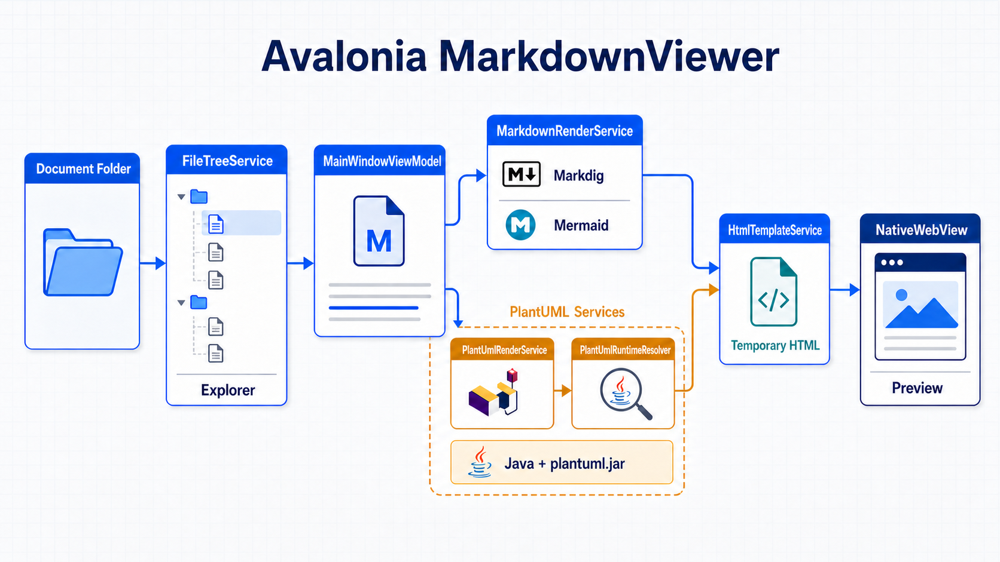

# Markdown Image Link Sample

This document verifies that a PNG image referenced with a relative Markdown path is displayed in the preview.

## Avalonia MarkdownViewer Architecture

The Avalonia viewer builds the Explorer tree through `FileTreeService` and coordinates the selected document in `MainWindowViewModel`. `MarkdownRenderService` renders Markdown, Mermaid, and PlantUML content into temporary HTML, which `NativeWebView` displays through a local file URI.
