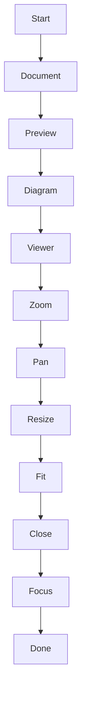
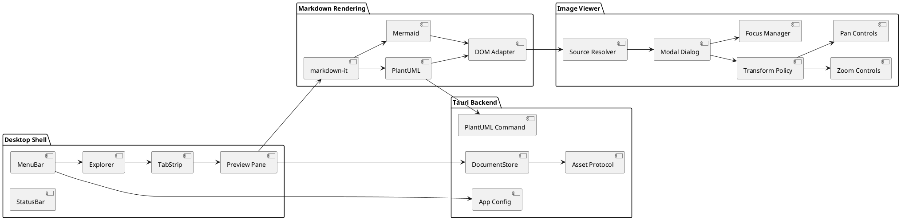

# Image Viewer Manual Fixture

この文書はTauri版のMarkdown画像viewerで、通常画像、Mermaid、PlantUMLのzoom / pan / focus / layout非退行を確認するためのfixtureです。

## 通常画像

Inline imageを含む段落の行組み確認: before  after。viewer decoration前後で本文の折り返し位置が変わらないことを確認します。

[Linked image navigation target](multi_tab_link_target.md)

## 横長Mermaid

```mermaid
flowchart LR
  A[Open Folder] --> B[Scan Directory]
  B --> C[Open Markdown]
  C --> D[Render markdown-it]
  D --> E[Render Mermaid]
  E --> F[Decorate Visual]
  F --> G[Open Image Viewer]
  G --> H[Fit]
  H --> I[Zoom 800 percent]
  I --> J[Pan to every edge]
  J --> K[Close and Restore Focus]
```

## 縦長Mermaid

## 大規模PlantUML

## 通常リンク回帰

- [同一root内Markdown](multi_tab_link_target.md)
- [同一文書内anchor](#通常画像)
- [External URL](https://example.com/)
