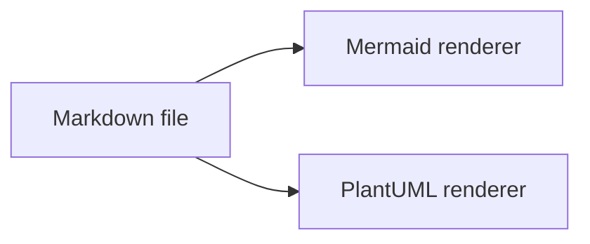
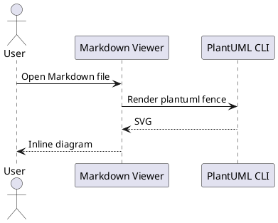

# PlantUML Sample

This document is used to verify PlantUML rendering in both desktop viewers.

Mermaid must continue rendering when PlantUML diagrams finish.





The shorthand form is also supported.

```puml
class MarkdownRenderService
class PlantUmlRenderService
class PlantUmlRuntimeResolver

MarkdownRenderService --> PlantUmlRenderService
PlantUmlRenderService --> PlantUmlRuntimeResolver
```
