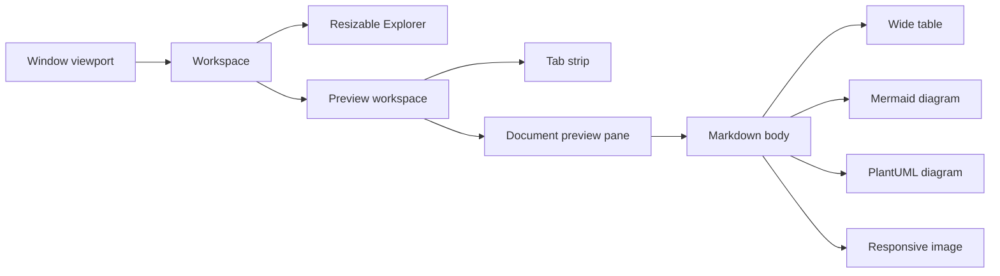
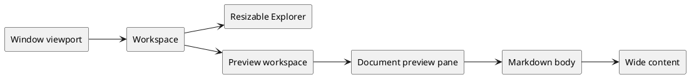

# Responsive Preview Width Fixture

This document verifies that the Tauri Markdown preview uses the available preview pane width instead of stopping at a fixed 980px maximum.

## Wide Table

| Requirement | Explorer | Tabs | Markdown | HTML | Mermaid | PlantUML | Images | Theme | Reload | Security |
| --- | --- | --- | --- | --- | --- | --- | --- | --- | --- | --- |
| Expected behavior | Resizable pane remains independent | Active document remains selected | Body follows pane width minus gutter | Iframe follows the full pane width | Wide diagram uses the expanded body | Wide SVG uses the expanded body | Image scales within the body | Light and Dark remain readable | Layout remains stable | HTML sandbox and protocol remain unchanged |

## Wide Mermaid Diagram



## Wide PlantUML Diagram



## Responsive Image


## Long Code Line

```text
window viewport -> workspace -> resizable explorer + preview workspace -> tab strip + document preview pane -> responsive Markdown body -> wide table / Mermaid / PlantUML / image
```
